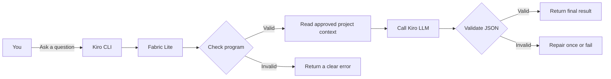
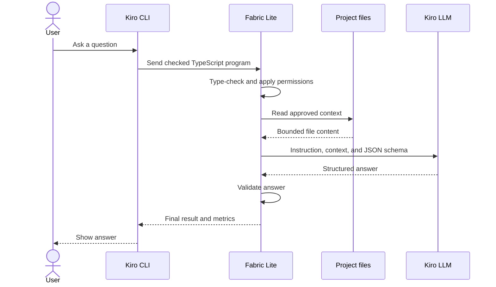

# Fabric Lite

Fabric Lite lets **Kiro CLI** use an LLM through small, checked TypeScript programs. These programs can safely read a project, split work into a few AI calls, check structured answers, and return one final result.

## At a glance



## Requirements

- Node.js 20 or newer
- [pnpm](https://pnpm.io/)
- Kiro CLI, signed in (`kiro-cli login`)

## Install

Clone this repository, open it in a terminal, and run:

```bash
pnpm run setup:kiro
```

This installs dependencies, builds the app, adds the Fabric Lite Kiro agents and prompts, creates `.fabric-lite/config.json`, and checks the setup.

To preview the files without changing anything:

```bash
pnpm run setup:kiro --dry-run
```

If generated files already exist, use `--force` to back them up and replace them:

```bash
pnpm run setup:kiro --force
```

## Use the app

Start Kiro with the Fabric Lite agent:

```bash
kiro-cli --agent fabric-lite
```

Then ask normal questions, for example:

```text
Find the cause of the failing tests and suggest a fix.
```

Every request is turned into a checked Fabric Lite program. The program reads only approved project files, may make a limited number of LLM calls, validates the answers, and returns a compact result.

Check the installation at any time:

```bash
node dist/cli/main.js doctor
```

## Programmatic LLM usage

**Programmatic LLM usage** means calling an LLM from code instead of typing one prompt directly into a chat window. Code decides what context to send, how many calls to make, and what answer format is required.

A Fabric Lite program is a TypeScript function body with top-level `await` and `return`. For example, save this as `example.ts`:

```ts
const files = await fabric.fs.glob({ pattern: "src/**/*.ts" });

const answer = await fabric.ai.run({
  instruction: "Briefly describe this TypeScript project.",
  context: { files },
  outputSchema: {
    type: "object",
    properties: { summary: { type: "string" } },
    required: ["summary"],
    additionalProperties: false,
  },
});

return answer.value;
```

Run it with:

```bash
node dist/cli/main.js run --file example.ts --format json
```

Fabric Lite type-checks the program, applies budgets and permissions, sends the request to Kiro, validates the JSON response, and saves run details in `.fabric-lite/runs/`.

> Programs cannot use `import` or `require`. File access stays inside the project, writes and shell commands are disabled by default, and destructive commands are denied.

More examples are in [`examples/`](examples/). Built-in API help is available with:

```bash
node dist/cli/main.js docs
```

## Uninstall

There is no automatic uninstall command. From the repository root, remove the generated project files:

```bash
rm -rf .fabric-lite
rm -f .kiro/agents/fabric-lite.json .kiro/agents/fabric-lite-worker.json
rm -rf .kiro/prompts
```

Remove the global Kiro agent files:

```bash
rm -f ~/.kiro/agents/fabric-lite.json ~/.kiro/agents/fabric-lite-worker.json
```

If you no longer need the source checkout, delete this repository too. You may also remove the `.fabric-lite/runs/` and `.fabric-lite/cache/` lines added to `.gitignore`.

> If `.kiro/prompts/` contains your own files, do not delete the whole folder; remove only the Fabric Lite files listed in `.kiro/prompts/.fabric-lite-manifest.json`.

## How it works



Each run is recorded in `.fabric-lite/runs/<run-id>/`, which can contain project-sensitive context and results. This directory is ignored by Git, but it is not temporary.

Default limits allow up to 7 AI calls with concurrency up to 3. Read access is allowed; commit, command execution, and network access require approval; destructive actions are always denied. Settings are in `.fabric-lite/config.json`.

For more detail, see [Kiro setup](docs/KIRO_SETUP.md) and [security](docs/SECURITY.md).
