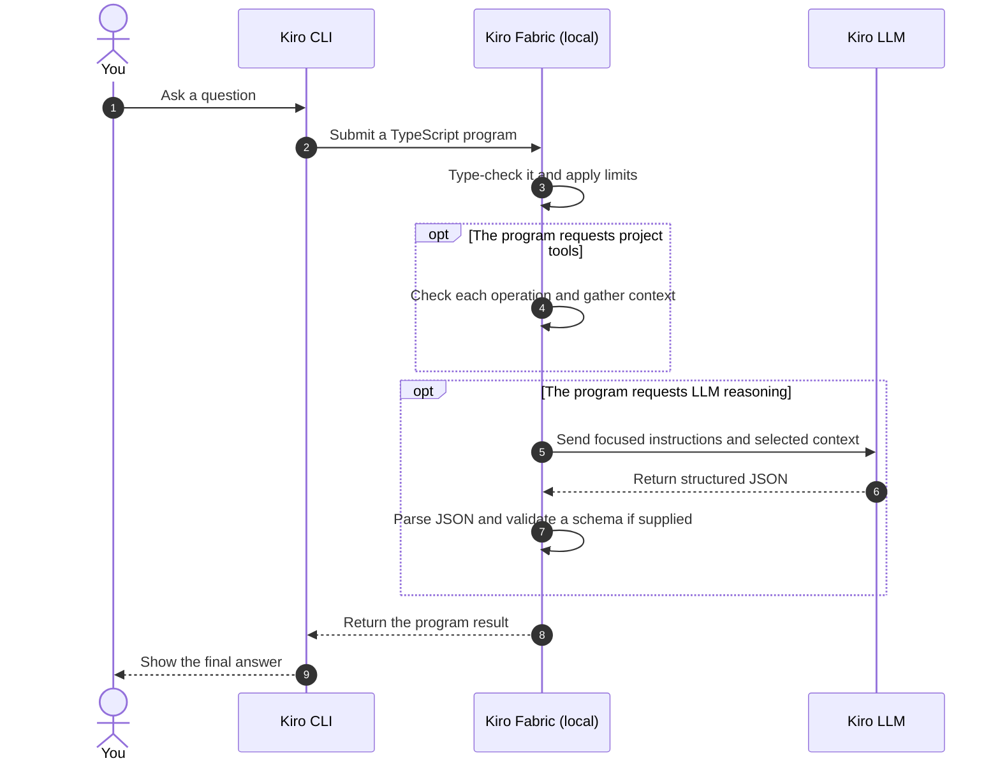

# Kiro Fabric

Kiro Fabric is a local runtime that lets TypeScript programs use Kiro CLI as a structured reasoning backend. It is not a separate LLM model: it orchestrates the model configured in Kiro CLI.

## Programmatic AI and why Kiro Fabric exists

**Programmatic AI** (or **programmatic LLM usage**) means calling an LLM from code instead of relying on one free-form chat response. The program chooses the instructions, context, number of calls, and required output structure, then handles the returned data as part of a larger workflow.

Ordinary chat prompting is useful for exploration, but a broad prompt leaves context selection, multi-step coordination, and response formatting mostly to the conversation. Kiro Fabric adds a small, inspectable program between the question and the model. Kiro can generate a TypeScript program for the task; that program gathers only the project context it needs, calls the Kiro LLM through the `fabric` API, and returns one result that the surrounding automation can inspect, transform, save, or display. The workflow can therefore be reviewed, tested, repeated, and composed with ordinary development logic rather than treated as an opaque chat exchange.


## How it works

From a user question to one structured result:

1. **You ask a normal question in Kiro CLI.** For example, you can ask it to find the cause of failing tests.
2. **Kiro generates a small TypeScript program** tailored to the question. The program uses the `fabric` API and can use top-level `await` and `return`.
3. **Kiro Fabric checks the program before running it.** It type-checks the script, then applies the configured filesystem, Git, shell, AI-call, size, concurrency, and time limits.
4. **The program gathers bounded context.** It searches or reads only the files and excerpts it requests, subject to the available project-tool permissions and limits.
5. **The program invokes the Kiro LLM programmatically.** `fabric.ai.run()` (or `fabric.ai.parallel()` for independent calls) receives explicit instructions, selected context, and optionally a JSON Schema for the response.
6. **Fabric validates and returns one result.** The response is parsed and checked against the schema when one is supplied, with the configured repair behavior. The program can then combine or transform its data and returns the final result to Kiro, which shows it to you.



Project-tool access, LLM calls, and response schemas are optional; a generated program uses only what its task needs. Defaults allow up to 7 AI calls with concurrency up to 3. Change limits and permissions in `.fabric-lite/config.json`.

### Example: a bounded programmatic call

This program searches for a few TypeScript files, sends selected excerpts to the LLM, and requires a small JSON object rather than an unstructured answer:

```ts
const paths = await fabric.fs.glob({
  pattern: "src/**/*.ts",
  maxResults: 5,
});

const files = await fabric.fs.readMany({
  paths,
  maxFiles: 5,
  maxCharsPerFile: 3000,
  maxTotalChars: 12000,
});

const answer = await fabric.ai.run({
  instruction: "Using only these excerpts, briefly describe the project.",
  context: files.map(({ path, content }) => ({ path, content })),
  outputSchema: {
    type: "object",
    properties: { summary: { type: "string" } },
    required: ["summary"],
    additionalProperties: false,
  },
});

return answer.value;
```

Run it with:

```bash
node dist/cli/main.js run --file example.ts --format json
```

Programs are TypeScript function bodies with top-level `await` and `return`; `import` and `require` are not allowed.

## Benefits

| Capability | Concrete benefit |
| --- | --- |
| Checked TypeScript programs | Workflows can be reviewed, tested, repeated, and composed before they run |
| Bounded search and file reads | Less irrelevant prompt context and potentially lower token use, depending on the task and model |
| Explicit instructions and JSON Schema validation | More predictable parsed data for downstream code, with one optional repair attempt |
| Call, size, concurrency, and time limits | Controlled resource use and faster independent analysis when parallel calls are appropriate |
| Project-contained tools and permissions | Controlled access to files, Git, shell, and inspections rather than unrestricted automation |
| Local run records | Easier debugging through saved programs, diagnostics, metrics, and results |

Kiro Fabric limits calls and characters; it does not measure or promise a fixed number of provider tokens.

## Requirements

- [Git](https://git-scm.com/)
- Node.js 20 or newer
- [pnpm](https://pnpm.io/)
- [Kiro CLI](https://kiro.dev/docs/cli/) available as `kiro-cli` and signed in (`kiro-cli login`)

## Install

```bash
git clone https://github.com/asx8678/kiro-fabric.git
cd kiro-fabric
pnpm run setup:kiro
```

Setup installs dependencies, builds Kiro Fabric, creates the Kiro agents, prompts, and `.fabric-lite/config.json`, then runs a health check.

```bash
# Preview generated agent, prompt, and configuration files
pnpm run setup:kiro --dry-run

# Back up and replace conflicting generated files
pnpm run setup:kiro --force
```

A dry run still installs dependencies and rebuilds `dist/`; it only avoids writing generated Kiro and configuration files.

## Use the app

In the configured repository, run:

```bash
kiro-cli --agent fabric-lite
```

Then ask a normal question, such as:

```text
Find the cause of the failing tests and suggest a fix.
```

To configure another repository, run this from the Kiro Fabric clone:

```bash
node dist/cli/main.js install-kiro --cwd /path/to/your/project
cd /path/to/your/project
kiro-cli --agent fabric-lite
```

From the Kiro Fabric clone, check a configured project with:

```bash
node dist/cli/main.js doctor --cwd /path/to/your/project --format json
```

### Text output

The CLI defaults to readable text output for `check`, `run`, and `exec`, styled with a gold accent: a branded run header, numbered source between `─ program` and `─ result` (or red `─ error`) rules, diagnostics with carets, and live interaction on stderr — a run-start line plus one line per AI call (`›` ok, `↻` repair, `✗` failed). Retried calls are also summarized in the header. Add `// @name: My program` (and optionally `// @description: ...`) near the top of a program to label its run header. JSON output remains available with `--format json`. Set `FABRIC_LITE_HIGHLIGHT=1` (also `true`, `yes`, or `on`) to enable simple source highlighting. Colors follow the usual conventions: shown only on a TTY and disabled via `NO_COLOR`.

## Safe mutation workflow

Writes remain disabled unless `.fabric-lite/config.json` sets `mutation.enabled` and `filesystem.allowWrite`. Configure `mutation.require` as `clean` (default) or `checkpoint`, and bound review diffs with `mutation.maxDiffChars` (default `30000`). A checkpoint snapshots the dirty tracked worktree with a temporary Git index; ignored files are not included and the real index and branch are unchanged.

```ts
const session = await fabric.mutate.begin({ mode: "checkpoint", label: "update config" });
await fabric.fs.write({ path: "src/config.ts", content: "export const enabled = true;\n" });
const diff = await fabric.mutate.diff();
const review = await fabric.mutate.review();
if (review.value?.approved) return await fabric.mutate.complete();
return await fabric.mutate.rollback();
```

After `complete()`, use its rollback guidance. In checkpoint mode it includes `git restore --source=<checkpoint> --worktree -- .`, manual deletion of created files, and `git update-ref -d refs/fabric-lite/checkpoints/<unique-id>`.

## AI call caching

Caching is disabled by default. Enable it for deterministic requests with bounded entries and optional expiry:

```json
{
  "cache": { "enabled": true, "maxEntries": 200, "ttlMs": 3600000 }
}
```

Keys include the redacted request context, instruction, role, schema, model, limits, and runner configuration. Cache hits do not consume AI budgets; entries live in `.fabric-lite/cache/`.

## Security and privacy

- Selected context is sent to the Kiro LLM. Secret filtering helps, but it is not complete data-loss prevention.
- Reads are allowed by default; writes, local commits, and generic shell are disabled by default.
- Commands classified as destructive are denied. If you enable generic shell, approved commands are still powerful.
- Headless runs deny actions with an `ask` policy. In interactive mode, **Allow session** approves the whole category until the process exits.
- `.fabric-lite/runs/` is persistent and may contain sensitive data. The installer adds it to `.gitignore`; verify this in every project.
- Kiro Fabric runs trusted local programs and is not a sandbox for hostile JavaScript.

See [security details](docs/SECURITY.md).

## Troubleshooting

- **Kiro unavailable:** run `kiro-cli --version`, then `kiro-cli login`.
- **Missing or changed agents/prompts:** run `node dist/cli/main.js doctor --format json`, then rerun setup.
- **Setup conflict:** review the file, then use `pnpm run setup:kiro --force`; backups are created first.
- **Changes not visible:** restart Kiro after reinstalling.
- **Real LLM health check:** run `node dist/cli/main.js doctor --smoke`; this makes a real call and may use paid quota.

## Uninstall

There is no automatic uninstall command. In each configured repository, first remove only prompts listed in its installer manifest:

```bash
node --input-type=module <<'NODE'
import { readFile, rm } from "node:fs/promises";
import path from "node:path";

const directory = ".kiro/prompts";
const manifestPath = path.join(directory, ".fabric-lite-manifest.json");
const manifest = JSON.parse(await readFile(manifestPath, "utf8"));
const names = Object.keys(manifest.files ?? {});

for (const name of names) {
  const safe = name === path.posix.basename(name) && name === path.win32.basename(name);
  if (!safe || name === ".fabric-lite-manifest.json") throw new Error(`Unsafe entry: ${name}`);
  await rm(path.join(directory, name), { force: true });
}
await rm(manifestPath, { force: true });
NODE
```

Then remove project files and, once, the global agents:

```bash
rm -rf .fabric-lite
rm -f .kiro/agents/fabric-lite.json .kiro/agents/fabric-lite-worker.json
rm -f ~/.kiro/agents/fabric-lite.json ~/.kiro/agents/fabric-lite-worker.json
```

Unrelated prompts and backups are left untouched. You may also remove the two `.fabric-lite/` lines added to `.gitignore` and delete the source clone.

## More help

```bash
node dist/cli/main.js docs
```

See [`examples/`](examples/) and the detailed [Kiro setup guide](docs/KIRO_SETUP.md).


Adam Stodulski
