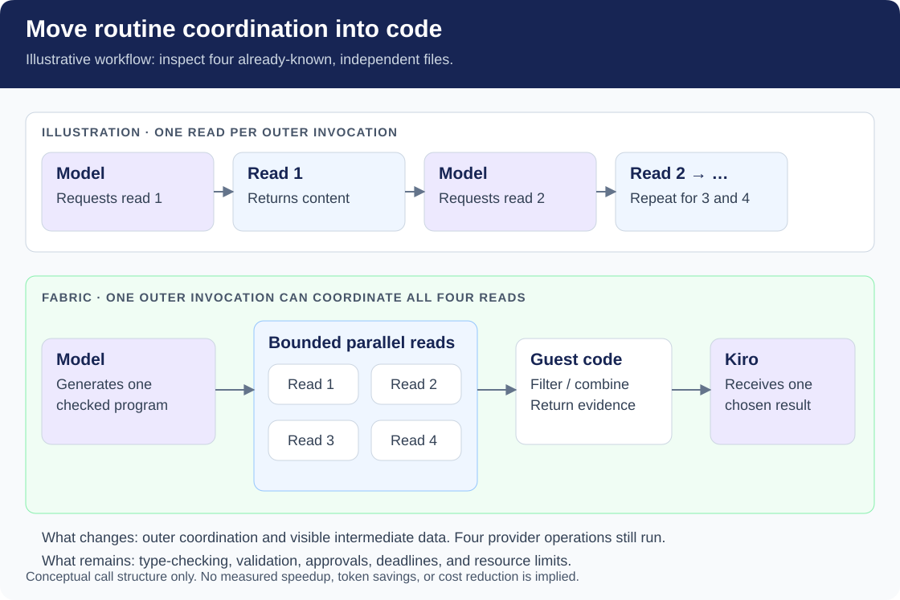
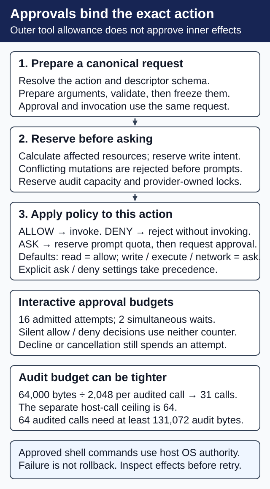
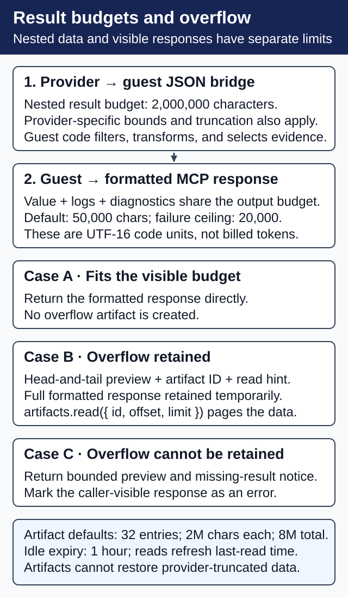

# Kiro Fabric

A coding agent for **Kiro CLI v3**. The model writes TypeScript; Fabric checks it, runs it in QuickJS, and controls access to files, shell commands, memory, and configured MCP tools.

## Start

Requires an authenticated Kiro CLI with v3 support, Node ≥24, pnpm 11.20.0, Bash, and ripgrep for local development.

Source installation targets Linux (glibc ≥2.28, kernel ≥4.18) and macOS ≥13.5, on x64 or ARM64, including Apple Silicon. Native macOS/ARM qualification remains pending; platform support is not production certification. The source checkout may be exactly the selected Kiro home (normally `~/.kiro`) or outside it; nested overlapping checkouts remain rejected. To enable automatic activation after future fast-forward pulls, install once with `bash ./install.sh --source --kiro-home "$HOME/.kiro" --enable-pull-hook` from the checkout at `~/.kiro`. See [installation and platform requirements](docs/installer.md).

If `bash ./install.sh` reports “No such file or directory”, your checkout does not contain the installer. Confirm the repository revision and obtain a revision containing `install.sh`; changing operating systems or creating an empty script will not fix a missing file.

```sh
# From this repository:
pnpm install --frozen-lockfile
pnpm run agent:install

# From your project:
cd /path/to/your/project
"$HOME/.kiro/kiro-fabric/bin/kiro-fabric" start
```

## Execution

Open any diagram to zoom, or use its text version.

[](docs/images/execution-flow.svg)

[Execution: text version](docs/diagram-descriptions.md#execution)

## Efficiency

Fabric batches tool work, overlaps independent I/O, and filters results before returning them to the model. Actual speed and cost savings are not yet established.

[](docs/images/efficiency-flow.svg)

[Efficiency: text version](docs/diagram-descriptions.md#efficiency)

## Technical details

<details>
<summary><strong>Permissions and action limits</strong></summary>

[](docs/images/approval-boundary.svg)

[Permissions: text version](docs/diagram-descriptions.md#permissions)

</details>

<details>
<summary><strong>Output limits and temporary artifacts</strong></summary>

[](docs/images/output-flow.svg)

[Output: text version](docs/diagram-descriptions.md#output)

</details>

<details>
<summary><strong>Sessions, memory, and data lifetimes</strong></summary>

[](docs/images/sessions-and-storage.svg)

[Lifetimes: text version](docs/diagram-descriptions.md#lifetimes)

</details>

**Status:** source installation is available. Signed releases and authenticated compaction/resume qualification remain blocked. [Release status](docs/release.md).

[Architecture](docs/architecture.md) · [API](skills/fabric-exec/references/api.md) · [Configuration](docs/configuration.md) · [Security](SECURITY.md)

Development: `pnpm run build`. Before committing: `pnpm run check`.
