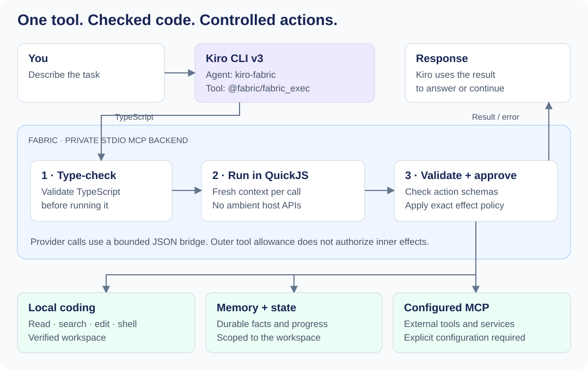
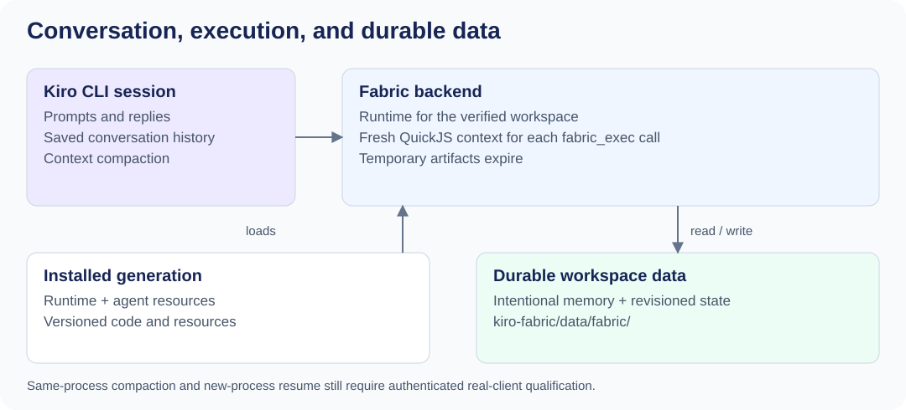

# Kiro Fabric

A custom agent for **Kiro CLI v3** that turns tool work into checked TypeScript. Kiro handles the conversation; Fabric runs code, checks permissions, and connects it to your workspace and configured MCP tools.

## Start

Requires Kiro CLI with v3 support and separate Kiro authentication. To install from this checkout, you also need **Node ≥24**, **pnpm 11.20.0**, ripgrep (`rg`), and a supported POSIX host.

```sh
# From this repository, as your normal user:
pnpm install --frozen-lockfile
pnpm run agent:install

# From the project you want to work on:
cd /path/to/your/project
kiro-cli --v3 --agent kiro-fabric
```

Export `KIRO_HOME` before installation and launch to use a custom Kiro home.

**Status:** source installation is available. Public signed releases and authenticated real-client qualification remain blocked; compaction/resume behavior still needs verification. See [configuration](docs/configuration.md) and [release gates](docs/release.md).

## How it works



The model sees one tool: `@fabric/fabric_exec`. Each call gets a fresh QuickJS context with no direct filesystem, shell, or network access. Provider calls cross Fabric’s validated bridge; allowing the outer tool does **not** approve nested effects.

For example, Kiro can send this function body to `fabric_exec`:

```ts
const files = await local.find({ pattern: "src/**/*.ts", limit: 20 });
return files;
```

| Inside Fabric | Purpose |
| --- | --- |
| `local` | Read, search, edit, write, and run shell commands |
| `tools`, `mcp` | Discover capabilities and call explicitly configured MCP tools |
| `memory`, `state` | Store durable facts and revisioned task progress |
| `fabric` | Inspect runtime, read API help, and select a workspace |

A single verified workspace root binds automatically; multiple roots require explicit selection. Web, LSP, and delegation need configured MCP capabilities. [Guest API →](skills/fabric-exec/references/api.md)

## Sessions and storage



Kiro owns history and compaction. Fabric stores intentional workspace facts and task state; temporary artifacts are not durable memory. Restart Kiro after installing an updated generation. The intended same-process lifecycle through compaction remains a real-client qualification gate.

## Maintain

```sh
# Update from this checkout:
pnpm install --frozen-lockfile
pnpm run agent:install

# Development:
pnpm install --frozen-lockfile
pnpm run build
pnpm run check  # Required before committing
```

[Architecture](docs/architecture.md) · [Configuration](docs/configuration.md) · [Security](SECURITY.md) · [MIT license](LICENSE)
