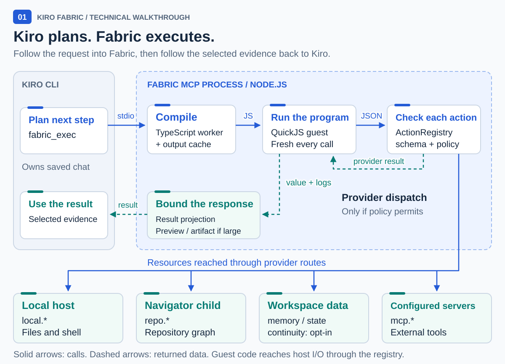
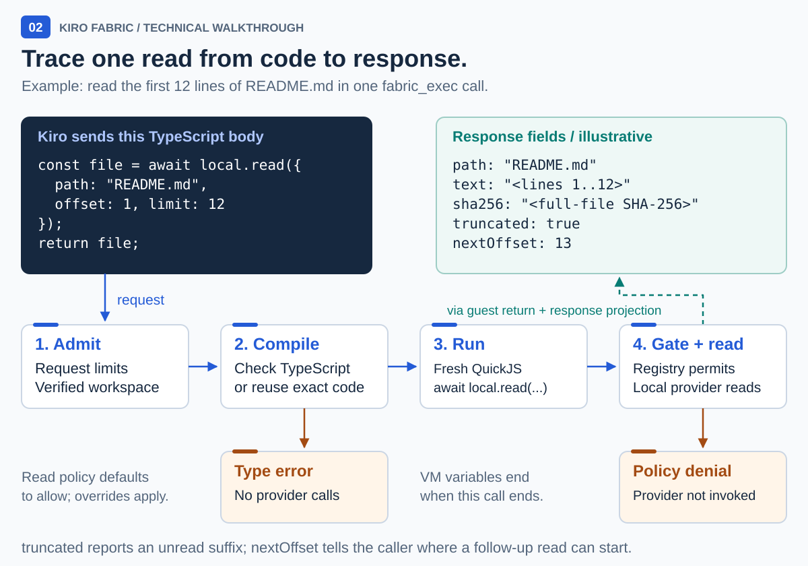
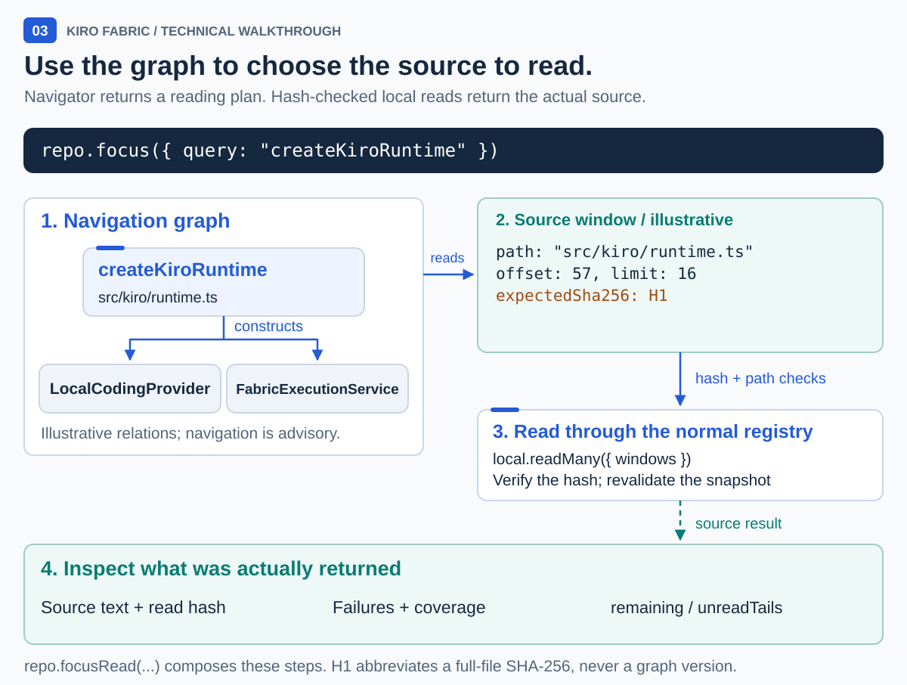
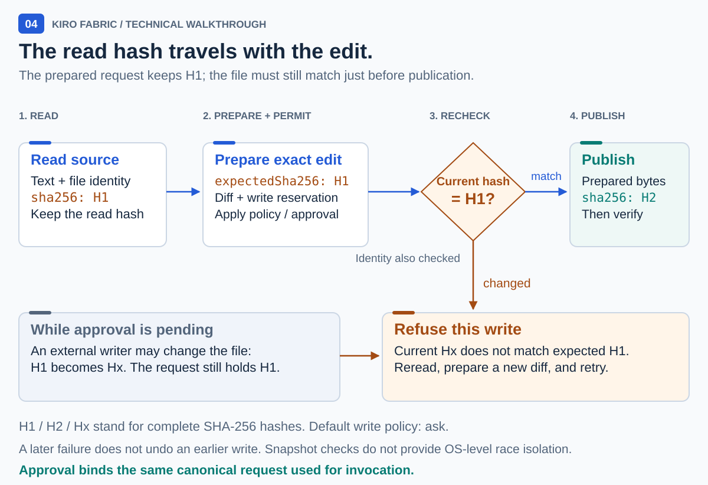

# Kiro Fabric

Kiro Fabric pairs Kiro's conversation and planning with a checked TypeScript execution backend. The agent profile exposes `@fabric/fabric_exec`: Kiro sends a program, Fabric runs its provider calls through workspace and approval checks, and selected evidence returns to the conversation.



[Full-size topology](docs/images/runtime-topology.svg) | [Text description and source references](docs/diagram-descriptions.md#runtime-topology) | [Technical walkthrough](#how-kiro-and-fabric-work-together)

## Install

Native repository intelligence: see [Navigator usage and qualification](skills/fabric-exec/references/fovea.md). Explicit analysis is implemented; automatic native-client lifecycle/delivery is not yet qualified.

Requires Bash, Git, Node >=24, pnpm **11.20.0**, tar/gzip, and Kiro CLI >=2.21.1 with v3 support on PATH.

From your Kiro Fabric checkout, run:

```sh
bash ./install.sh --source --kiro-home "${KIRO_HOME:-$HOME/.kiro}" --no-shell-integration
```

The installer builds and installs Fabric with Navigator, backs up existing configuration, and makes the selected Kiro home and its `agents` directory private (0700). Source upgrades replace an old Fabric profile only when its recorded ownership and checksum match. Existing user skills, other agents, configuration and runtime generations are preserved. Do not use `sudo`. Executable ancestry must already have safe ownership and permissions, as must shell configuration if shell integration is enabled; see the preflight troubleshooting below.

The default installation is `~/.kiro/kiro-fabric/`, with the active profile at
`~/.kiro/agents/kiro-fabric.json`. To use a separate Kiro home, pass
`--kiro-home "$HOME/.kiro-fabric"`; use its installed launcher afterward.
For a guided overview with the current version, exact paths and upgrade policy,
run `node scripts/install-tui.mjs` from the checkout.

For unattended installation, add `--yes --non-interactive`. The command above leaves shell configuration untouched; use the installed launcher below. To configure the optional bash/zsh shortcut, omit `--no-shell-integration`. Existing aliases or unowned/modified Fabric shell blocks must be reconciled before enabling that shortcut.

After installation, start a new session from your project directory:

```sh
"${KIRO_HOME:-$HOME/.kiro}/kiro-fabric/bin/kiro-fabric" start
```

The launcher supplies the selected Kiro home and canonical workspace. The current profile also supports launch-directory binding without the shell shortcut; see [workspace troubleshooting](docs/installer.md#troubleshooting-verified-workspace-binding-is-required--explicitly-empty).

For a headless check, put options after `chat`:

```sh
KIRO_HOME="${KIRO_HOME:-$HOME/.kiro}" KIRO_FABRIC_LAUNCH_WORKSPACE="$(pwd -P)" \
  kiro-cli chat --v3 --agent kiro-fabric --output-format stream-json --require-mcp-startup \
  'Use fabric_exec to return fabric.info(). Do not use native tools.'
```

On Kiro CLI 2.21.1, putting `--agent kiro-fabric` before an explicit `chat` subcommand selected the default agent in our probes. Confirm the selected mode is `kiro-fabric` and the stream contains an actual `@fabric/fabric_exec` call and successful result; a native file read is not a Fabric check. Correctly selected Fabric worked on the first turn—warm-up prompts are not a verified remedy. Profile validation and doctor do not establish full tool filtering or interactive approval readiness.

Restart existing Kiro sessions after an update. If you enabled the optional shell shortcut, open a new terminal to load it before running `kiro-cli --v3`.

**Current client limitations:** the 2026-09-25 macOS retest on Kiro CLI **2.24.0** still returned `No handler registered for method: _kiro/mcp/elicitation` in v3; v2 rejected form approval as unsupported, and the legacy UI also failed the approval test. Reads succeeded, but the approval-dependent edit stayed blocked in all three paths. See the [current evidence and client fix required](docs/upstream-client-issues.md#2026-09-25-cli-2240-retest). Earlier Linux tests also observed `disclose_context` outside the strict single-tool profile; complete tool filtering remains unqualified on 2.24.0. Do not treat the `/tools` view or a model-authored tool list as complete filtering evidence, or enable blanket trust to bypass a missing approval UI.

## How Kiro and Fabric work together

These diagrams describe the repository's execution contracts. Native-client qualification remains subject to the limitations above. Open an image at full size for its technical labels; each has a selectable text version with implementation links.

### From one tool call to checked actions

A `fabric_exec` request carries a TypeScript function body and optional named string `payloads`, `resultFormat`, and `timeoutMs`. New programs are checked against Fabric's guest declarations; successful exact source and declarations can reuse cached compiler output. Every execution gets a fresh QuickJS context, and every nested provider action still passes through the registry's validation, reservations and approval policy.



[Full-size execution sequence](docs/images/checked-call-sequence.svg) | [Text description and source references](docs/diagram-descriptions.md#checked-call-sequence)

Independent I/O can overlap inside one program; read-dependent edits and verification stay ordered. Intermediate values remain in the guest unless returned or printed. The default visible response budget is 50,000 UTF-16 code units, including logs; overflow uses a bounded preview and an artifact when retention succeeds. This is a bounded execution model, not a claim of measured speed or token savings.

### From Navigator hints to actual source

Navigator (`repo.*`, implemented under `src/fovea/`) builds advisory maps from verified source snapshots. `repo.focus` returns suggested source windows with content hashes; `local.readMany` reads those windows through the ordinary registry. `repo.focusRead` composes both steps. Inspect the returned source, failures and continuation metadata before making code claims or edits.



[Full-size Navigator pipeline](docs/images/navigator-evidence-flow.svg) | [Text description and source references](docs/diagram-descriptions.md#navigator-evidence)

The graph reports coverage gaps; it does not establish correctness or complete inspection. A stale hash requires refreshed navigation and a new read. Analysis availability, same-call advisory suffixes, and native prompt/stop delivery are separate capabilities; see [Navigator usage and qualification](skills/fabric-exec/references/fovea.md).

### From a source read to a version-bound edit

`local.edit` requires `expectedSha256` from the read that supplied its replacement anchors. Fabric prepares the complete diff, freezes the canonical request, and reserves write intent before applying policy. After approval, it rechecks the snapshot before publishing the prepared bytes. The default write policy is `ask`; missing approval support blocks that action.



[Full-size edit flow](docs/images/edit-consistency-flow.svg) | [Text description and source references](docs/diagram-descriptions.md#version-bound-edits)

A program can commit several separate actions. A later failure does not undo earlier effects, so inspect current source or durable state before retrying. Shell execution has host OS authority; these file-provider checks do not confine shell commands.

## If the CLI preflight fails

If you see:

```text
Kiro Fabric: Kiro CLI help/version preflight failed; authentication was not attempted
```

The installer could not complete a CLI check with a temporary home and a restricted environment. Read-only CLI help/version and private-tool version probes allow two attempts only when the first returns `ETIMEDOUT`, retaining the 5-second timeout per attempt. Other failures are not retried. This is not an authentication failure.

Run these commands in the same terminal:

```sh
type -a kiro-cli
kiro-cli --version
kiro-cli agent validate --help
```

Confirm that Kiro CLI is available, its version is >=2.21.1, and the validation help includes `--path`. If a command fails, resolve that CLI error first. If both CLI commands succeed but preflight still fails, report the outputs above and the installer error; normal CLI checks can pass while isolated checks fail. The bounded timeout retry is already automatic; do not repeatedly rerun the whole installation.

If the installer instead reports `Unsafe Kiro CLI directory ancestry` or `unsafe shell integration file permissions`, inspect the named path's ownership and permissions. For your own trusted path, remove group/other write access (`chmod go-w <path>`); for shell configuration you can instead use `--no-shell-integration`. `umask 022` affects newly created paths only—it does not repair existing permissions. Preview the install with `bash ./install.sh --source --kiro-home "${KIRO_HOME:-$HOME/.kiro}" --no-shell-integration --dry-run --json`.

If you see `Unowned or modified Fabric shell block preserved`, rerun the install command above with `--no-shell-integration`. The installer preserves the existing shell block; the installed launcher works without changing it.

For `doctor --source-root <checkout>` reporting `unsafe diagnostic metadata permissions`, check `package.json`, `install.sh`, `README.md`, `pnpm-lock.yaml` and `tsconfig.json` in that trusted checkout. Remove group/other write access from the reported metadata; do not bypass ownership checks.

Do not delete configuration or rerun with `sudo`. A failed installation is not a guarantee that nothing changed; preserve any reported backups or recovery evidence.

See [installation details](docs/installer.md) for prerequisites and recovery.

Optional [deterministic task recovery](docs/configuration.md#deterministic-task-recovery-opt-in) provides durable declared checkpoints, explicit host-operation capture, and reproducible summaries. Disabled by default; it does not replace Kiro's native compaction.

## Development checks

The former fast/full behavioral suites were removed. Current commands deliberately distinguish local development checks from unavailable release qualification:

- `pnpm run check:local` — guidance consistency, typecheck, fresh build and dead-code lint only. It does **not** run the offline aggregate or certify installer or native behavior.
- `pnpm run verify:references` — bounded project-reference audit.
- `pnpm run verify:offline baseline` — the existing offline verifier baseline checks.
- `pnpm run verify:offline installer` — existing installer checks; I07 still reports incomplete staging coverage, so this is not a passing aggregate.
- `pnpm run verify:offline runtime` — focused non-browser removal regressions against a fresh build: public surfaces, configuration, discovery/execution, local files, memory/state/continuity and authorization boundaries. This is not the deleted full suite.
- `pnpm run verify:offline quality` — focused cleanup regressions: capability-probe CLI, bounded subprocess behavior and retained core APIs. Uses isolated retained fixtures, not a real client or repository.
- `pnpm run verify:offline all` — runs baseline, installer, runtime and quality cases; required incomplete installer coverage still blocks the aggregate. It is not wired into `check:local` yet.
- `pnpm test`, `pnpm run test:fast` and `pnpm run test:built` — retained command names that report unavailable suites and exit nonzero; they do not run Vitest or produce current suite-timing evidence.
- `pnpm run check` — still required before committing/releasing. It runs `check:local`, then the release-grade unavailable gate, and intentionally cannot certify this working tree. `prepack` and `release:candidate` remain chained to it.

Finish source changes with `pnpm run build`: Kiro loads `dist/`, not `src/`. Passing static checks or a build is not behavioral acceptance. Historical test counts and `.tmp/vitest-report.json` are not evidence for the current checkout. See [browser removal and current verification scope](docs/browser-removal.md) for coverage and blocked gates.

### Retained local task state

The local CI task roots, home-sentinel wrapper, component certifier, tool-download scratch, CI tool rematerialization and bundle/Agent staging helpers no longer recursively delete their temporary trees. They report paths to stderr immediately after allocation (`[fabric:task-root]` in Node helpers). Unpublished staging is retained; successful publication may rename it into a validated generation, so the original staging path need not remain.

Default builds also preserve the previous `dist/` or `dist/kiro-agent-closure/` in a private `.tmp/generated-output-*` directory before creating fresh output. Bounded inspection refuses Git/worktree/bare metadata, symlinks, hardlinks, unsafe permissions and uncertain trees rather than replacing them. Explicit closure `--outdir` still requires a new directory. Cache capture and GC's pre-removal check now explicitly refuse repository metadata; cache GC is not a cleanup mechanism for retained scratch.

Authenticated qualification homes, coding fixtures, release-inspection scratch and private release inputs are retained too. **Retained or unverified private state blocks qualifying output and release uploads.** The real-client workflow initializes/finalizes diagnostics through `scripts/qualification-failure.mjs`; only strict, bounded `.sanitized.json` copies are eligible for diagnostic upload—not original reports, raw trees or their contents. No authenticated client or release workflow was run for this repair.

Retention preserves unfamiliar files and failure evidence, but uses disk space. Do not blanket-delete `.tmp/` or the reported roots, prune retained repositories, or upload potentially private task contents. This is a bounded repair, **not** a guarantee about arbitrary child commands, hostile concurrent filesystem changes or every cleanup path. Private-state disposition, missing behavioral coverage and native qualification remain blocked; no release gate is relaxed.
