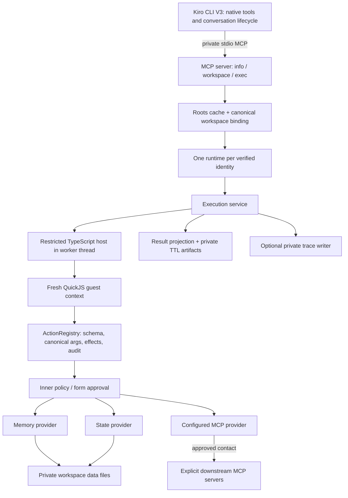

# Repository Audit & Improvement Plan

> Historical pre-implementation audit. Findings and source line references describe the recorded dirty baseline, not the subsequently fixed working tree. See [IMPLEMENTATION_NOTES.md](IMPLEMENTATION_NOTES.md) for follow-up changes and fresh validation; the original evidence is retained unchanged.

## 1. Executive Summary

**Decision: targeted fixes and incremental refactoring; no rewrite justified.** Confidence: High for this decision within the reviewed execution/persistence boundaries; Medium for whole-product fitness because authenticated Kiro qualification and substantial release/installer paths remain unverified.

The inspected working tree builds and typechecks. The selected local tests establish useful, specific behavior: checked QuickJS composition, state/memory restoration, two-process compare-and-set integrity, and EOF shutdown. The architecture separates native Kiro tools from Fabric effects and has explicit validation, approval, workspace identity, resource budgets and packaging boundaries. These are worth keeping, not replacing (`src/kiro/runtime.ts:34-68`, `src/core/action-registry.ts:179-249`, `src/runtime/type-checker.ts:119-193`; C007, C013, C015).

**Most consequential findings:**

| ID | Classification | Priority | Consequence |
|---|---|---|---|
| F-001 | Confirmed, runtime + static | P2 | Ordinary failed state/artifact writes leave unmanaged files; repeated failures can accumulate disk residue outside normal accounting/cleanup. |
| F-002 | Confirmed, runtime + static | P2 | Configured MCP discovery ignores pagination; tools beyond the first page cannot be discovered, described or called. |
| F-003 | Hypothesis, static mechanism confirmed | Conditional P2 | With tracing enabled, free-form downstream error messages can enter private trace files despite the documented no-secrets guarantee. Actual sensitive content/exposure was not observed. |

No credible P0 emergency was established in reviewed paths. No production deployment or credential exposure was verified. **Release readiness is Not verified**: the repository explicitly says real-client lifecycle qualification remains blocked (`STATUS.md:5-7`). This audit does not remove that gate.

**Execution evidence:** typecheck, build, dead-code lint, staging, 28 selected existing tests and a built-library probe passed. One new audit-only pagination regression failed and supports F-002. Two benign I/O fault probes observed F-001. The advisory scanner reported zero matches, not an absence-of-vulnerabilities assurance. The original checkout—including its dirty application files and generated closure—was not rebuilt or edited. All modifications are audit deliverables; checks ran in a disposable copy.

## 2. Audit Scope & Provenance

### Target and inspected state

- Root: `/home/adam/projects/kiro-fabric`; branch `main`; HEAD `3121512fb1940d2794b1cbba58f59362ace8b490`.
- Audit date: **2026-09-05 UTC**. Non-shallow history; 87 reachable commits. This is a **dirty working-tree audit, not a pristine-commit audit**.
- Baseline includes uncommitted MCP server, memory, workspace-binding and state-provider changes; new `src/kiro/info-catalog.ts`; build, install and qualification changes; corresponding docs/tests; and replacement generated closure output. Full status: [baseline-status.txt](evidence/baseline-status.txt). The status also includes this newly created audit directory, which is excluded from the application baseline.
- [baseline-files.json](evidence/baseline-files.json) records SHA-256, size and line counts for available tracked/non-ignored untracked files, excluding audit output. It captures actual dirty contents. Deleted tracked files are represented by Git status, not a fabricated content hash.
- C016 found no changes to those original files since C005. All 78 original tracked/non-ignored closure files matched the fresh sandbox build byte-for-byte. This does not prove an archive is reproducible across platforms.

### Capabilities, safety and limitations

Linux x86-64, kernel 6.17.0-1022-azure, glibc 2.39; Node **v24.20.0**, pnpm **11.20.0**, Vitest **4.1.11**. Local read/search/shell tools and fovea code-graph navigation were available. No production credentials, databases or endpoints were used. No deployments, publishing, installs into the user's Kiro home, or real-client authentication were performed.

A network-isolated bwrap smoke check failed (`C004`: OS capability limitation, no retries). Checks therefore used a private disposable file copy, a clean allowlisted environment, isolated HOME/KIRO_HOME/TMPDIR, and reviewed local test paths—not a claimed OS security sandbox. C006 unexpectedly caused Corepack/pnpm to download pnpm and recreate copied dependencies, including the declared esbuild lifecycle script, **inside the disposable copy**. No explicit install command was requested by this audit. This setup side effect is preserved in the command log; direct installed versions were subsequently compared (C016). The authorized dependency audit contacted the package registry (C011). No repository source or credentials were deliberately transmitted. No other external research was performed.

All checks have explicit 10–120 second subprocess budgets; no blocked operation was repeatedly retried. The full `pnpm run check` was **not run**: its complete test/packaging/certification chain was not safety-reviewed in full. Targeted reviewed checks were chosen instead. No source coverage percentage, live service load test, macOS run, full-history secret scan, branch-protection inspection or real Kiro session was attempted.

### Component coverage ledger

“Read” is not equivalent to end-to-end verified. Exact inspected windows are in [read-ledger.json](evidence/read-ledger.json). All significant components were inventoried; deeper review was prioritized by effect authority, durable data, architectural centrality and current-history hotspots.

| Component / included paths | Review depth | Runtime evidence / unfinished work |
|---|---|---|
| `src/kiro/mcp-entry.ts`, `mcp-server.ts` | Request/lifecycle paths statically traced | C015: actual stdio, EOF, cross-process persistence. Workspace changes, elicitation and all termination variants not executed. |
| `src/kiro/power/workspace-{binding,context}.ts`, `canonical-path.ts`, `agent-launch-context.ts` | Binding transitions and launch identity traced; binding schema header not fully read | Single-root flow exercised in C015; manual/multi-root/path-race cases static only or not verified. |
| `src/kernel/`, `src/config.ts`, `schema-validation.ts`, `async-settlement.ts` | Contract/validation/settlement read; config normalization middle section only searched | C008 config assertions; C013 type error; kernel barrel not deeply reviewed. |
| `src/execution-service.ts`, `src/core/action-registry.ts` | Full source read and selected invocation path traced | C013 real guest -> registry -> effects; C012 mock federation. Digest implementation inventoried, not independently reviewed. |
| `src/runtime/` | QuickJS main lifecycle, setup excerpt, compiler host/pool, guest declarations traced | C013/C015 exercise compiler worker and VM. Host JSON-budget implementation was subsequently read; full guest promise scheduler, stack maps and pathological termination tests not reviewed end to end. |
| `src/kiro/runtime.ts`, `memory-provider.ts`, `providers/state-provider.ts` | Full source read, dispatch and state transaction traced | C008/C009/C013/C015. |
| `src/kiro/memory.ts`, `power/data-paths.ts` | Memory mutations/search and storage setup excerpts traced | C013/C015 exercise integrated storage. Remaining ownership/read helpers, migration generations and unusual filesystems not fully reviewed. |
| `src/kiro/artifacts.ts`, `projection.ts`, `info-catalog.ts` | Full source read | C008/C013 cover TTL, isolation, catalog byte bounds, artifact error residue. Projection edge tests not run. Artifacts-provider wrapper only searched/inventoried. |
| `src/kiro/mcp-provider.ts` | Invocation/discovery/lease cleanup traced; transport identity helpers only searched | C012 in-memory fake, no external or stdio downstream endpoint. Config staging, executable/argument hashes, OAuth implementation incompletely reviewed. |
| `src/trace/` | Tracer full read; writer flush/close excerpt read | No tracing-specific suite run. F-003 static review only. |
| `scripts/build*`, `assert-build-artifacts`, `package-policy`, `validate-agent-package`, `agent-profile` | Read before execution | C007/C014 run build/stage validation; no full archive/installer run. |
| `scripts/install-agent-user.mjs` | Install commit/rollback and uninstall excerpts read | Ownership preflight helpers, pruning tail and migration not fully traced; no installation executed. |
| Other `scripts/` (certification, real-client driver, archive, SBOM, reports, trace analyzer) | Inventory/search only | Excluded from deep review due scope/time and external-client/destructive lifecycle dependencies. No readiness assurance. |
| `tests/` | 24 files inventoried; four files/subsets run; federation fixture read | 28 existing tests passed; 7 lifecycle cases excluded by name filter, not evidence of flakiness. Others not run. |
| `.github/workflows/`, docs, manifests | Four workflows and selected docs read | Configured behavior only; remote permissions/protections and historical job results unknown. |
| `dist/`, `node_modules/`, media, lockfile | Generated/vendor inventory; SDK pagination excerpt inspected; direct lock entries checked | Closure build/import checks and hash comparison; not line-by-line vendor/generated audit. Image not semantically reviewed. |
| `.git/`, ignored `.pi/`, `.tmp/`, user/global homes | Git metadata only; ignored/private content excluded | No secret/history assurance or inspection of existing qualification transcripts. |

## 3. Project Understanding

### Purpose, requirements and assumptions

**Documented:** a native Kiro CLI V3 coding agent, exposing native Kiro tools and one private stdio MCP backend. Fabric supplies bounded checked-TypeScript composition, private ephemeral artifacts, workspace-scoped durable memory/state and explicitly configured downstream MCP federation. Native file/shell/web/subagent authority belongs to Kiro; Fabric does not replace it (`README.md:1-11`, `scripts/agent-profile.mjs:1-21`).

**Inferred users:** local coding-agent operators and consumers of the exported Node library (`package.json:1-13`, `src/index.ts:1-50`). Actual adoption, team size, production scale, SLOs and business-critical workflows are unknown. No multi-tenant web service is evidenced. Workspace namespaces are not a substitute for isolation between hostile users sharing an OS identity.

**Explicit requirements:** strict checking before guest execution; QuickJS-only guest runtime; exact inner approvals independent of outer wrapper permissions; root identity validation; bounded work/output; data persistence across process restart; global install without checkout-local agent shadowing; authenticated exact-release qualification (`SECURITY.md:1-5`, `docs/architecture.md:3-25`, `docs/release.md:3-19`). Whether “durable” includes machine power loss or network filesystems is unresolved.

### Stack, entities and deployment

TypeScript/ESM on Node >=24; pnpm; esbuild library bundle plus closed agent closure; TypeScript declaration generation and isolated worker checking; QuickJS/WASM; TypeBox validation; MCP SDK and mcporter; Vitest and Knip. No database server, queue, browser frontend, serverless function or scheduled worker is present in the shipped architecture (`package.json:30-48`, `package.json:70-88`, `agent-product.json:1-28`). Local timer-based cleanup is not a deployed scheduled job.

Main entities:

| Entity | Relationship / boundary | Evidence |
|---|---|---|
| Workspace identity | Canonical path + device/inode, ctime for approval windows; binds runtime generation and project storage | `src/kiro/canonical-path.ts:10-30`; `src/kiro/power/workspace-binding.ts:193-237` |
| Action descriptor | Provider/action ref, schemas, risk/effects and semantic digest; canonical args approved before invocation | `src/core/action-registry.ts:39-58`, `179-230` |
| State document v1 | Global document revision; key -> value, entry revision, timestamp; CAS checks current entry revision | `src/providers/state-provider.ts:11-24`, `113-146`, `173-205` |
| Memory entry | Namespace/key -> JSON value, updatedAt, byte accounting; per-namespace mutation lock | `src/kiro/memory-provider.ts:28-44`, `src/kiro/memory.ts:606-659` |
| Artifact | Opaque random ID -> process-owned content/file, idle TTL, quotas; not durable conversation storage | `src/kiro/artifacts.ts:5-21`, `70-128` |
| Trace | Private bounded JSONL execution/span metadata; optionally enabled | `src/trace/tracer.ts:7-42`, `src/trace/trace-writer.ts:94-111` |
| Installed generation | Digest-bound runtime, skill/profile and ownership manifest; durable data separate | `scripts/install-agent-user.mjs:550-605`, `632-694` |

Documented installation is `$KIRO_HOME/kiro-fabric/{runtime/<digest>,skills,data/fabric}` with profile under `$KIRO_HOME/agents`. No running installation was inspected. Compatibility names containing “power” remain in storage identities and deprecated APIs; renaming them casually risks orphaning state (`docs/architecture.md:7`, `src/index.ts:21-41`).

Configuration: private `config/config.json` and sibling `mcp.json` under the Fabric data root. File schemaVersion 1; legacy conversion in memory; unknown fields/future versions rejected without rewrite (`src/config.ts:131-199`, `292-336`; C008). File loading is strict while programmatic normalization deliberately clamps/defaults—different interfaces, not automatically a defect. Relevant environment names: `HOME`, `KIRO_HOME`, `PATH`, `KIRO_FABRIC_RUNTIME_ROOT`, `KIRO_FABRIC_DATA_ROOT`, `KIRO_FABRIC_EXPECTED_NODE`, `KIRO_FABRIC_DEBUG`; qualification-only `KIRO_CLI_PATH` and `KIRO_API_KEY`. Values were not inspected. Launch root separation is explicit (`src/kiro/power/agent-launch-context.ts:31-41`); profile sets runtime/data/interpreter names (`scripts/agent-profile.mjs:48-58`). No distinct dev/prod configuration profile is evidenced; local staging and installed execution differ in physical layout.

### Annotated structure and entry points

```text
kiro-fabric/
├── src/
│   ├── index.ts                 library API exports
│   ├── execution-service.ts     checking, quotas, bridge orchestration
│   ├── core/                   registry + semantic descriptor digest
│   ├── kernel/                 fabric_exec request contract
│   ├── runtime/                QuickJS, compiler worker, budgets, mappings
│   ├── kiro/                   stdio entry/server, runtime, federation/storage
│   │   └── power/              compatibility-named binding/approval/data helpers
│   ├── providers/              state document storage
│   └── trace/                  bounded private JSONL
├── scripts/                    build, stage, install, qualification, packaging
├── tests/                      Vitest component and subprocess tests
├── docs/                       configuration, architecture, release, tracing
├── skills/fabric-exec/          installed agent instructions/API reference
├── .github/workflows/           CI, candidate, trusted qualification, release
├── dist/kiro-agent-closure/     shipped closed runtime (generated)
└── agent-product.json           exact shipped surface/dependency contract
```

Entry points: `src/index.ts` (library), `src/kiro/mcp-entry.ts` (stdio process), `src/runtime/compiler-worker-entry.ts` (worker thread), scripts listed in `package.json:30-48`. No application HTTP listener or frontend entry was identified in this inventory.

### Measurements and Git signals

C005 counts available tracked + non-ignored untracked files; excludes audit output, `.git`, ignored/vendor content. Lines are `splitlines()` physical lines, not executable LOC or complexity. Source: **38 files / 7,222 lines**; tests: **24 / 6,334**; scripts: **21 / 6,214**; docs: **7 / 279**; workflows/CODEOWNERS: **5 / 241**. Generated closure: **78 files / 14,458,219 bytes**. C007 reached **35 source modules**; do not confuse this with reviewed-file count. Largest non-generated binary: `media/cover.jpg`, 300,475 bytes (not a defect).

C002 reachable first/last commit timestamps span 2026-08-28 to 2026-09-04, not proven project inception. Author-name buckets are 76 and 11 commits; aliases/bots and team context unknown. C016 counts filename appearances in `git log --format= --name-only -- src scripts`, filtered to extant files: MCP server 18; runtime 13; execution service/workspace binding 12 each; registry 11; federation/data paths 10 each. Counts do not measure churn lines, defect density or individual productivity. Earlier unfiltered history contained deleted product paths.

### Actual architecture and critical flows



1. **Execution / effect:** stdio request refreshes roots; validates the envelope; acquires identity-scoped runtime; sets outer deadline; compiler checks; fresh guest bridges exact call; registry prepares/validates/freezes args, reserves overlapping writes, requests approval, invokes and records outcome; projection bounds response (`src/kiro/mcp-server.ts:319-487`, `src/execution-service.ts:85-266`, `src/core/action-registry.ts:179-249`, `src/kiro/projection.ts:70-112`). C013 covers built-library middle path; C015 covers actual stdio integrated persistence. Not every guard is runtime-tested here.
2. **Durable update:** provider registration requires workspace storage/config enablement; state lock serializes read/CAS/write; temp fsync then rename; memory uses namespace lock and atomic file replacement. C015 observes competing writes and separate-PID restoration after process death. F-001 concerns pre-commit I/O cleanup, not a demonstrated lost committed value (`src/kiro/runtime.ts:43-56`, `src/providers/state-provider.ts:113-146`, `214-294`, `src/kiro/memory.ts:606-685`).
3. **Federation:** registry canonical preparation loads explicit definition and transport snapshot; network approval and additional stdio/OAuth execution approval precede contact; one per-server lease and operation budget encompass discovery + invocation; descriptor digest and schema checked before call. Discovery only fetches the first page: F-002 (`src/kiro/mcp-provider.ts:578-713`, `869-897`, `923-996`). Transport helpers were not fully traced, so this is not a complete federation security assurance.
4. **Shutdown / rebinding:** lifecycle queue serializes runtime transitions, aborts leases, waits for quiescence; process entry races shutdown against eight seconds and watches parent/stdin. Same-server leases deliberately quarantine unsettled work rather than claim cancellation stopped an effect (`src/kiro/mcp-server.ts:223-268`, `489-507`, `src/kiro/mcp-entry.ts:40-102`, `src/kiro/mcp-provider.ts:923-996`). C015 covers EOF and process restart, not all parent/descendant/cancellation outcomes.

## 4. Qualitative Scorecard

Anchors: 1 serious deficiencies; 2 substantial weaknesses; 3 mixed/adequate with material gaps; 4 strong within inspected scope; 5 consistently strong and well-supported. These are **judgments, not measurements**; no overall numeric average.

| Dimension | Score | Justification / evidence | Confidence and scope |
|---|---:|---|---|
| Architecture | 4 | Distinct host/guest/effect boundaries; limited mounted surface; compatibility preserved. `src/kiro/runtime.ts:34-68`, registry trace above. No whole-repo cycle analysis. | Medium; selected runtime paths |
| Correctness | 3 | Positive integrated CAS/restart behavior, but F-001/F-002 confirmed. C008/C012/C015. | High within tested scope |
| Code Quality | 3 | Strict TS, explicit lifecycle ownership; uneven I/O cleanup (F-001), dense policy script; dynamic VM handles use `any`. | Medium; representative source only |
| Testing | 3 | Valuable cross-process behavioral tests; pagination fixture loses cursor, document-write error cleanup absent from inspected assertions. C008/C015 and F-001/F-002. | Medium; selected tests, not full suite |
| Security | Not assessed | Controls statically traced and benign assertions passed; insufficient independent coverage for a whole-product security score. F-003 unresolved; no attack testing. | Medium control observations; low whole-product assurance |
| Performance | Not assessed | Bounded mechanisms inspected; no representative workload/SLO or bottleneck measurement. | Static observations only |
| Reliability/Ops | 3 | Private atomic/CAS persistence and EOF/process restart tests; I/O residue F-001; real-client and machine-crash durability gaps. | Medium |
| Dependencies | 4 | Exact runtime dependencies, lock/closure policies, clean scanner result C011 and direct identities C016. Current support/latest/legal conclusions unknown. | Medium; packaging/identity scope |
| Documentation/DX | 3 | Explicit lifecycle limitations and setup commands; successful build/stage. Tracing's unconditional no-secrets claim requires F-003 review. | Medium; docs/scripts inspected |

Representative positives: immutable canonical arguments (`src/core/action-registry.ts:194-230`), isolated compiler host (`src/runtime/type-checker.ts:119-147`), meaningful process-level data assertions (`tests/mcp-process-lifecycle.test.ts:516-575`, `628-676`), centralized build options (`scripts/esbuild-common.mjs:1-17`). Representative negatives: asymmetric file cleanup F-001; fixture strips pagination (`tests/mcp-federation.test.ts:59-67`); `scripts/package-policy.mjs:7-10` compresses many policy checks into dense lines, making review harder, but style alone is not a severity finding. `tsconfig.json:6-18` enables strictness and unchecked-index/optional-property checks; script checking deliberately uses weaker strictness (`tsconfig.scripts.json:8-17`). No demonstrated type-safety defect is attributed solely to `any` at the QuickJS handle boundary.

Material review hotspots, not automatic refactor targets: state/artifacts (F-001), federation (F-002), execution trace boundary (F-003). Installer/real-client driver are additional **validation priorities**, not proven architectural offenders merely because they are large.

## 5. Feature Verification Matrix

| Feature | Requirement source / nature | Inspected scope and source evidence | Commands / method | Status | Confidence / unresolved cases |
|---|---|---|---|---|---|
| Library + closed Agent build | `package.json:30-35`, `agent-product.json:3-14`; explicit | build, closure, required imports/checks; `scripts/assert-build-artifacts.mjs:6-77` | C006/C007/C016; runtime + hash comparison | Verified within tested scope | High on Linux/current versions; no macOS/archive reproducibility proof |
| Staged package identity | `scripts/validate-agent-package.mjs:194-259`; explicit | stage -> digest/inventory/closure validator | C014; runtime | Verified within tested scope | High for one staging run; installer/corruption matrix not run |
| Checked QuickJS composition | `README.md:7-11`; explicit | service -> compiler host -> VM -> registry -> state/memory | C013, C015; runtime + static | Verified within tested scope | High; normal guest and simple type error only, no complete sandbox proof |
| Three-tool surface / native separation | `agent-product.json:11-12`; explicit | `src/kiro/mcp-server.ts:310-317`, `scripts/agent-profile.mjs:48-58` | static; C015 exercises info/exec, not tool-list exactness | Statically traced only | High source shape; real Kiro native tools not verified |
| Config v1 and legacy handling | `docs/configuration.md:3`; explicit | file safety, validation, in-memory migration | C008; `src/config.ts:131-199`, `292-336` | Verified within tested scope | High for inspected configuration tests; programmatic clamp matrix not fully run |
| Single-root workspace persistence | `docs/architecture.md:15-19`; explicit | roots -> binding -> project/runtime -> files | C015; `src/kiro/power/workspace-binding.ts:154-237` | Verified within tested scope | High on synthetic local root; different filesystems not tested |
| Manual/multi-root selection | `docs/configuration.md:7-13`; explicit | prepare/commit mutation and identity checks | `src/kiro/power/workspace-binding.ts:257-332`; static | Statically traced only | Medium; no real elicitation/client test |
| Independent inner approval | `SECURITY.md:5`; explicit | registry canonical snapshot -> approver -> MCP elicitation | `src/core/action-registry.ts:179-230`, `src/kiro/power/approver.ts:99-115`; C013 mock approver | Partially verified | High callback binding; actual accept/decline/timeout UI not executed |
| State CAS and restart | `docs/architecture.md:17-19`; explicit | lock, read, expectedRevision, rename; separate processes | C008/C015; source state provider | Verified within tested scope | High; one contention pair and process kill after commit, not power interruption |
| Failed-write cleanup | Private bounded storage expectation inferred from quotas/close | `src/providers/state-provider.ts:214-236`, `src/kiro/artifacts.ts:70-128` | C009/C013; synthetic EIO | Confirmed defect | High; F-001, successful data preserved in state probe |
| Artifact TTL and info catalog bounds | `README.md:9`; explicit | store and UTF-8 catalog fallback | C008; `src/kiro/artifacts.ts:90-108`, `src/kiro/info-catalog.ts:1-24` | Verified within tested scope | High; selected cases only, projection overflow runtime tests not run |
| Configured MCP pagination | SDK 1.30.0 tools/list cursor contract + local $tools/$call descriptors; protocol-supported expectation | `src/kiro/mcp-provider.ts:667-713`, `869-897`; installed SDK excerpts | C012; static + fake client | Confirmed defect | High; F-002; no live downstream testing |
| Projection and retry guidance | `README.md:9`; explicit | progress sampling, middle truncation, artifact fallback | `src/kiro/projection.ts:28-112`; static | Statically traced only | High source path; all output shapes not exercised |
| EOF shutdown | `docs/architecture.md:21`; explicit | entry cleanup -> server/runtime close | C015; `src/kiro/mcp-entry.ts:40-102` | Verified within tested scope | High; signal/parent/descendant cases excluded by filter |
| No sensitive trace content | `docs/tracing.md:3`; explicit | service errors -> tracer -> file | F-003; static | Partially verified | Mechanism known; actual downstream messages and trace exposure unknown |
| Install/update/uninstall preservation | `README.md:48-72`; explicit | commit/rollback/uninstall excerpts | `scripts/install-agent-user.mjs:461-694`, `810-948`; static | Partially verified | Medium; omitted helpers/pruning, no runtime installation |
| Kiro compaction/resume qualification | `STATUS.md:5-7`; explicit release gate | docs/workflows inventoried/read; driver not deeply reviewed | Not run | Not verified | Authenticated client unavailable/not authorized; component tests cannot substitute |
| Web UI, SQL/queue transactions, browser a11y | No shipped web/database/queue component in manifest/source inventory | `agent-product.json:3-28` | Inventory only | Not applicable | No repository-owned frontend; Kiro terminal accessibility not tested |

## 6. Detailed Findings — Single Register

### Correctness / implementation

### F-001 — Failed storage writes leave files outside normal cleanup/accounting

- **Classification:** Confirmed finding; Phase 2 correctness. Related: reliability, bounded storage, regression coverage.
- **Severity/urgency:** **P2**, routine near-term remediation. Impact is bounded to I/O-failure paths, but repeated failed attempts can grow disk residue and aggravate disk pressure. No demonstrated active data loss; no emergency containment needed.
- **Confidence:** **High**. Static ownership/cleanup trace corroborated by two local synthetic fault probes.
- **Evidence:** `src/providers/state-provider.ts:214-236`: temporary file write/fsync closes its descriptor in a first try/finally; cleanup belongs only to the later beforeCommit/rename try/catch. Failure in the first block never reaches file removal. `src/kiro/artifacts.ts:70-88` creates/writes/syncs a file before inserting it into `#entries`; `104-128` sweeps/closes only indexed files. Failed writes therefore leave unindexed artifacts. C009 left **one state temp file**, preserved the previous committed value, and released the lock. C013 left **one artifact file after close**. Both scripts exited 0 because they are observation probes, **not passing regressions for desired cleanup**.
- **Expected vs observed:** Inferred invariant: an operation that creates a private file but fails before publishing ownership should clean it up, or track it for bounded cleanup. Actual files remain unowned by normal cleanup. Storage bounds and explicit close reinforce this expectation (`src/kiro/artifacts.ts:73-85`, `122-128`). Corroborating better pattern: memory's encompassing error cleanup (`src/kiro/memory.ts:460-490`).
- **Conditions/impact:** Local filesystem write/fsync failure after file creation; no untrusted payload required. State files remain private and prior state was intact in the probe. Artifacts may later be removed by a new store's >24-hour residue sweep (`src/kiro/artifacts.ts:53-64`), mitigating indefinite retention after restart, but not current-process accumulation. No state-temp sweeping path appears in the fully read provider. Actual disk exhaustion rate is unmeasured.
- **Recommendation:** Small local changes: make cleanup own the created file immediately and span write, sync, close and publication failures; remove only the file this operation created; preserve the original failure if cleanup itself fails. Publish artifact accounting only after successful write. Avoid a sweeping generic transaction framework; memory's pattern is a useful reference, not an invitation to conflate durable and ephemeral storage semantics.
- **Validation (proposed):** Extend `tests/artifacts-state.test.ts` with document-write and document-fsync failures **after successful lock initialization**, plus artifact-write/fsync failures. Assert prior state unchanged, lock released, no created residue after failure/close, quotas recover, unrelated files untouched. C009/C013 are starting scenarios; they do not cover disk-full partial writes or close failures.
- **Effort:** **S**, assuming existing fs mocks and two localized implementation paths; one focused change with regression tests. No data schema/API migration needed. Related manifestations consolidated here rather than separate findings.

### F-002 — MCP discovery drops continuation cursors, disabling later-page tools

- **Classification:** Confirmed finding; Phase 2 correctness. Related: API contracts, integration testing, extensibility.
- **Severity/urgency:** **P2**, near-term fix before relying on a paginated configured server. Operators of single-page servers are unaffected; no evidence supports universal primary-flow outage or P1 severity.
- **Confidence:** **High**. The installed SDK contract, actual caller and SDK method were read; a deterministic in-memory two-page regression failed.
- **Evidence:** `src/kiro/mcp-provider.ts:869-897` calls `connection.client.listTools(undefined, ...)` once and returns only `response.tools`. `667-698` uses this result for `$tools`, exact-tool matching, `$describe` and `$call`; missing tool throws before invocation. SDK **1.30.0** `node_modules/@modelcontextprotocol/sdk/dist/esm/types.d.ts:2423-2458` defines request `cursor` and result `nextCursor`; `node_modules/@modelcontextprotocol/sdk/dist/esm/client/index.js:554-558` makes a single request and returns its result, not automatic pagination. Runtime version is corroborated by `pnpm-lock.yaml:22-24` and C016.
- **Expected vs observed:** Protocol supports continued tool discovery; local descriptors promise discovery/description/calling of configured tools (`src/kiro/mcp-provider.ts:27-77`). A bounded two-tool/two-page catalog should not silently appear complete after page one. C012 observed only `first`, two requests with no cursor (discovery and later call), zero downstream calls, and `Unknown or ambiguous MCP tool: synthetic.second`. The desired-list assertion failed. No actual network request occurred.
- **Conditions/impact:** A configured server returns `nextCursor` with a needed tool on a later page. All exposed federation discovery/call routes depend on this listing. Transport approval and input validation do not recover the missing page. The current inspected test fake discards continuation metadata (`tests/mcp-federation.test.ts:59-67`), explaining why first-page tests do not cover this contract.
- **Recommendation:** Paginate within the **existing single discovery/call deadline and server lease**; aggregate under explicit total tool/byte/page limits; apply allow/block filters consistently; detect repeated cursors and fail explicitly on incomplete listing instead of claiming completeness. Preserve digest binding and ambiguous-name rejection across pages. Do not reset the configured call budget per page or broaden approval scope.
- **Validation (proposed):** Turn C012 into a permanent regression. Add empty intermediate page, duplicate name across pages, repeated cursor, cancellation between pages, cumulative-limit and shared-time-budget assertions. Verify a second-page tool is callable exactly once after the expected approval. Existing single-page behavior/digest stability must remain unchanged.
- **Effort:** **S–M**, assuming downstream protocol handling stays inside `#listRawTools` and existing fake runtime can represent full responses. No schema/data migration; potential latency increase only for servers whose incomplete catalogs were previously ignored.

### Security — hypothesis requiring validation

### F-003 — Free-form downstream errors may violate the trace no-secrets contract

- **Classification:** **Hypothesis**; Phase 5 security. Related: logging, documentation, observability. The raw-message dataflow is confirmed statically; a sensitive-data incident is **not** established.
- **Severity/urgency:** **Conditional P2** if configured providers emit sensitive values in errors and tracing is enabled. Verification should precede sharing support/qualification traces; remediation next maintenance cycle if the contract is intended to be unconditional. No credential rotation or emergency cleanup recommended without evidence.
- **Confidence:** **High** for the mechanism, **Medium** for potential sensitive content; actual users/messages/exposure unknown.
- **Evidence:** `docs/tracing.md:3` says traces contain lifecycle metadata, not secrets. `src/execution-service.ts:195-211` puts approval/provider error messages into trace data using length truncation only. `src/trace/tracer.ts:77-114` and `src/runtime/json-budget.ts:79-90` serialize supplied fields; `src/trace/trace-writer.ts:127-149` writes them without semantic redaction. A rejected downstream call can retain its free-form error (`src/kiro/mcp-provider.ts:989-992`) through the registry's rethrow (`src/core/action-registry.ts:239-244`). No security payload or live error reproduction was executed.
- **Expected vs observed:** An unconditional metadata-only/no-secrets promise requires an allowlisted diagnostic boundary. The observed trace path accepts opaque error text. Truncation bounds quantity, not sensitivity. This is distinct from the redacted approval preview (`src/kiro/power/approver.ts:61-97`) and safe local schema errors (`src/schema-validation.ts:88-140`); those do not sanitize every provider exception.
- **Conditions/impact and mitigations:** Tracing defaults off (`src/config.ts:115-117`); files are created mode 0600 (`src/trace/trace-writer.ts:95-99`). These substantially limit exposure. A downstream library/service may include request context in errors; whether any used provider does so is unresolved. Copies/backups/support uploads could widen access, but none were inspected.
- **Recommendation:** Prefer stable allowlisted error codes/categories and bounded refs in routine traces; omit arbitrary error text. If free-form diagnostic traces are deliberately retained, explicitly document the sensitive-data boundary and operator handling policy rather than claiming they cannot contain secrets. Do not depend only on token-shaped regex redaction.
- **Validation (proposed, defensive only):** Assert trace event schemas permit only approved metadata fields; verify provider/approval errors cannot add raw-message fields to routine traces. Review downstream error contracts or operator-supplied **redacted** samples to confirm/reject actual sensitive-content risk. No discovered credentials should be used. If all error inputs are provably metadata-only, document that guarantee and the evidence; otherwise the hypothesis is confirmed under the stated conditions.
- **Effort:** **S–M**, depending on required diagnostic compatibility; source fix likely local, full error-origin inventory broader. No persistence migration. CWE/OWASP mapping not assigned: external taxonomy/advisory metadata was not retrieved and classification adds little to the remediation here.

## 7. Testing, Security, Performance and Dependency Summaries

### Testing and QA

| Layer | Inventory / evidence | Result and limitations |
|---|---|---|
| Unit/contract-style | configuration, registry, contract, JSON budgets, deadlines, compiler, info catalog, projection, tracing tests inventoried | C008: 25 tests in 3 files passed. Other unit files not executed; no coverage percentage. |
| Provider/storage integration | artifacts/state, memory-security, federation, workspace-binding, migration | Selected artifacts/state assertions passed; C012 exposes missing pagination. Other security/concurrency matrices not generally run. |
| Built runtime / subprocess | compiler worker, process lifecycle, hermetic staging, package boundary, archive/install | C013 built-library probe passed its behavior assertions; C015 3 selected subprocess tests passed; 7 deselected by `-t`. No evidence of flaky behavior from this one run. |
| Release/evidence contracts | release-evidence, sbom-identity, agent-profile/install/archive test files | Inventory only except script/config reads; not passing evidence. |
| Authenticated end-to-end | documented real Kiro qualification driver/workflow | Not run; no authenticated CLI, PTY, compaction, resume or accessibility assurance. |
| Property/snapshot testing | No systematic inventory of assertion styles completed beyond inspected files | Not verified; do not infer absence from file names. |

Vitest uses Node environment, restores mocks, disables file parallelism and sets 30-second test/hook timeouts (`vitest.config.ts:3-10`). Inspected storage tests clean temporary roots; subprocess tests kill only tracked synthetic children and remove their temporary roots (`tests/artifacts-state.test.ts:12-14`, `tests/mcp-process-lifecycle.test.ts:229-236`). This reduces interference in reviewed tests but says nothing about all fixtures or order dependence. Baseline tests were unchanged; the audit-only pagination test exists only in output artifacts and the disposable copy.

Prioritized gaps: **(1)** F-002 cursor-aware fake/contract tests; **(2)** F-001 post-lock file-I/O failure tests, complementing existing lock-initialization tests (`tests/artifacts-state.test.ts:101-130`); **(3)** F-003 metadata-only logging assertions; **(4)** full unchanged suite/packaging checks in an approved offline-capable environment; **(5)** retain the exact-release authenticated lifecycle gate. No need to modernize all CI before fixing the bounded defects.

CI is configured for main pushes, PRs and manual runs, with frozen lockfile, dependency audit and hermetic check; a macOS stage/install/archive job exists (`.github/workflows/ci.yml:3-57`). Release uses signed-tag verification, a separate qualification stage, exact-commit real-client artifact and a publish environment (`.github/workflows/release.yml:11-92`). Trusted qualification is manual, protected-default-branch gated and on a labeled self-hosted runner (`.github/workflows/kiro-agent-real.yml:3-20`). **Actual branch protections, environment approvals, runner isolation and successful remote checks remain unknown.**

### Security / applicability

| Boundary/control | Evidence and calibrated conclusion |
|---|---|
| Guest -> host | Restricted compiler host, fresh QuickJS context, memory/stack/deadline bounds and explicit bridge (`src/runtime/type-checker.ts:119-163`, `src/runtime/quickjs-runtime.ts:358-404`). C013 is a normal behavior probe, not an isolation proof. |
| Effects / identity | Canonical args/schema before independent policy approval, reserved overlapping writes, canonical workspace checks; static traces in §3. Real prompt acceptance/denial not tested here. |
| Downstream server | Explicit configuration and transport snapshots, additional execution approval, per-server cleanup leases inspected in part. Network/stdio helper internals incomplete. No external probing. |
| Sensitive assets | Private config, memory/state, artifact output, traces, and provider environment. Treat as potentially sensitive even though profile asks to store non-secret facts (`scripts/agent-profile.mjs:17-19`). F-003 needs review. |
| Secrets inventory | C016 format-only scan of 114 nonbinary tracked/non-ignored files, excluding dist/media/vendor/ignored/history, found no matches for three formats. **Not a comprehensive secret scan.** No token values emitted or validated. |
| Auth/session/MFA | Kiro owns user authentication/conversation; Fabric inner approval is not user-account authentication. No web login/session service in reviewed code. Kiro authentication security not assessed. |
| XSS/CSRF/CORS/headers/clickjacking | Not applicable to this private stdio backend's own interface; no repository frontend/HTTP app inspected. Downstream HTTP services are outside scope. |
| Cryptography | Hash-based identities and random IDs observed; not encryption, not a cryptographic audit. Library implementation and platform entropy not independently assessed. |
| Infrastructure/tenancy | No container/IaC deployment discovered in significant-path inventory; OS user-private storage is the evidenced boundary. Hosted multi-tenancy is not a supported assumption. |

### Performance, reliability and operations

| Observation | Method / consequence / next validation |
|---|---|
| State reads/mutations load a whole bounded JSON document; mutation serializes and syncs it | Static: `src/providers/state-provider.ts:149-236`; default 8,000,000 chars, 1,000 entries (`src/config.ts:103-108`). O(document size) per read/write; not a measured bottleneck. Measure realistic size/contended-write workloads before adopting a database. |
| Memory search scans/parses namespace entries then sorts matches | Static: `src/kiro/memory.ts:705-724`; default max 128 entries (`src/config.ts:102`). Reasonable bounded design absent larger requirements; no invented throughput target. |
| Warm compiler worker, fresh guest contexts | Static pool reuse/idle termination (`src/runtime/type-checker.ts:225-347`); per-context heap/stack limits (`src/runtime/quickjs-runtime.ts:381-404`). No aggregate same-process request admission cap was established; ask about concurrent caller load before adding a scheduler. |
| Build/stage costs | C007 wall time 2.940s; closure 14,458,219 bytes/78 files. C014 wall time 0.164s. Single Linux runs with installed dependencies; not benchmarks, cold-start claims or cross-platform estimates. |
| Downstream cancellation | One shared call budget, server lease held until operation/close settlement (`src/kiro/mcp-provider.ts:669-713`, `923-996`). Static mechanism, not proof that arbitrary remote effects stop on timeout. F-002 must preserve this design. |
| Trace buffering/retention | Optional traces, bounded writer, failure disables tracing; startup sweep keeps limited recent files (`src/trace/trace-writer.ts:127-149`, `src/kiro/mcp-server.ts:101-124`). No tracing load/retention recovery test run; F-003. |
| Persistence / recovery | C015 proves synthetic committed-data restoration after process kill, not power-loss durability. State rename lacks parent-directory fsync (`src/providers/state-provider.ts:214-236`); memory directory sync is best-effort (`src/kiro/memory.ts:475-490`, `678-682`). Clarify required durability and filesystem support before treating this as a product defect. |
| Backups/restore/readiness | No verified backup or restore drill. `fabric_info` is local health/status, not an externally deployed readiness endpoint (`src/kiro/mcp-server.ts:322-380`). Normal exits tested; stuck-provider and full descendant draining not verified. |

No proposed database, queue, distributed cache, circuit breaker or infrastructure replacement is justified by the available scale evidence. No numerical performance/coverage improvement is claimed.

### Dependencies and tooling

Resolved direct versions were read from original and disposable installed manifests and matched (C016); declared/locked versions: `package.json:73-85`, `pnpm-lock.yaml:17-49`.

| Dependency | Declared -> resolved | Evidenced role | Assessment |
|---|---|---|---|
| `@jitl/quickjs-singlefile-mjs-release-sync` | 0.32.0 -> 0.32.0 | WASM QuickJS implementation reached by closure C007 | Retain; independent engine/security review not completed |
| `quickjs-emscripten-core` | 0.32.0 -> 0.32.0 | QuickJS host bindings | Retain compatible pair; no version mismatch found |
| `@modelcontextprotocol/sdk` | 1.30.0 -> 1.30.0 | stdio/client protocol | F-002 is caller behavior, not evidence of an SDK defect |
| `mcporter` | 0.13.8 -> 0.13.8 | configured downstream transport | Snapshot/approval adapter worth retaining; full transitive behavior not audited |
| `typebox` | 1.3.25 -> 1.3.25 | schemas and validation | Bounded local schema policy inspected (`src/schema-validation.ts:17-59`) |
| `typescript` | 6.0.3 -> 6.0.3 | build/checking and runtime compiler | Runtime dependency is intentional; explains part of closed bundle, not dead weight by itself |
| `@types/node` | ^26.4.1 -> 26.4.1 | development types | Node 24 minimum is tested locally; compatibility of all APIs against minimum runtime not independently inventoried |
| `esbuild` | ^0.28.2 -> 0.28.2 | bundling | Only permitted build lifecycle entry in workspace policy (`pnpm-workspace.yaml:11-15`) |
| `knip` | ^6.34.0 -> 6.34.0 | dead-code lint | C010 passed only its configured src/tests project scope (`knip.json:3-9`), not scripts-wide dead-code proof |
| `vitest` | ^4.1.11 -> 4.1.11 | test harness | C008/C015 observed selected behavior, not full-suite health |

Lockfile overrides include brace-expansion 5.0.9, fast-uri 3.1.6, hono 4.12.34, nanoid 3.3.18 and qs 6.16.0 (`pnpm-lock.yaml:7-12`). No vulnerability or necessity claim is made from those entries alone. C011 scanner denominator was **301 total dependency records**; its dependency/dev/optional counts overlap and must not be summed as distinct packages. It returned an empty advisory set. Current releases, external support status and external license verification are **Unknown—not externally verified**. Local manifest license strings are in `supplement.json`; they are not legal conclusions. The closure builder gathers package/license records and notices (`scripts/build-kiro-closure.mjs:75-136`); the complete SBOM/license audit was not run. No unjustified update campaign is recommended.

## 8. Rewrite vs. Refactor Decision

1. **Keep:** Node/TypeScript/QuickJS; closed compiler host; ActionRegistry; independent approvals; workspace-scoped file storage with CAS; exact product manifests; staged digest-bound distribution. Concrete behavior already exists and passes focused checks (C007/C013/C015). Preserve deprecated API/storage compatibility.
2. **Incrementally fixable:** F-001's local ownership/cleanup gap and F-002's incomplete protocol enumeration. F-003 is best addressed at a narrow trace-event boundary once the required diagnostic policy is settled.
3. **Incremental change impractical?** No evidence establishes this. No schema collapse, unreplaceable dependency, cyclic architecture or scale failure was demonstrated. A shared atomic-write helper is an alternative only if characterization shows identical semantics; local fixes are smaller and safer first.
4. **Replacement risks:** hidden approval/cancellation rules, filesystem identity salts, install ownership/rollback semantics, output contracts, type-checker/VM parity and real-client lifecycle behavior would all need rediscovery. A database migration would introduce conversion/reconciliation/rollback obligations without demonstrated performance need. Actual team capacity is unknown; concurrent feature delivery must remain possible.
5. **Supported option:** **targeted refactors**, not subsystem/full rewrite. Confidence High for observed defects; broader architectural decision remains limited by missing deployment/load/qualification evidence. Reconsider a specific storage subsystem only if representative measurements or required durability/scale cannot be achieved with bounded file storage. Reconsider federation internals only if protocol characterization shows broader incompatible assumptions—not because one pagination bug exists.

## 9. Prioritized Improvement Plan

### Target architecture (proposal)

Retain the diagram in §3. Add only narrow behavioral boundaries inside existing modules:

```text
Existing execution / registry / approvals retained
  ├── MCP provider -> [PROPOSED bounded paginated discovery loop] -> existing client/lease
  ├── state/artifact writes -> [PROPOSED operation-owned cleanup] -> existing filesystem layout
  └── tracing -> [PROPOSED metadata-only error projection] -> existing bounded JSONL writer
```

These are proposed internal responsibilities, **not existing public APIs or authorization to implement**. No language, framework, database or deployment change proposed.

**Principles/non-goals:** preserve exact approvals and descriptors; preserve per-operation deadlines and cancellation; keep immutable generation/data layout and deprecated aliases; avoid broad rewrites, automatic migrations, arbitrary cleanup of existing user files, global policy changes, and performance-driven abstractions without measurements.

### Milestones

Effort sizes assume a maintainer familiar with existing Vitest fakes; not measured elapsed estimates. Each milestone is independently shippable, with review/build/release qualification appropriate to the changed artifact.

| Milestone | Scope / tasks | Dependencies, risk and mitigation | Definition of done / value | Size |
|---|---|---|---|---|
| M0: establish reproducible regression evidence | Preserve this dirty-state snapshot; port C009/C012/C013 failure scenarios into **proposed additions** to `tests/artifacts-state.test.ts` and `tests/mcp-federation.test.ts`. Confirm intended complete-discovery/cleanup behavior with maintainers. | No broad CI dependency. Do not overwrite the user's ongoing changes. Tests must be synthetic and local. | Regressions fail for the precise F-001/F-002 reasons; existing selected checks still pass; accepted behavior documented. Enables small safe fixes. | S |
| M1: restore complete bounded federation | F-002; cursor-aware discovery in `src/kiro/mcp-provider.ts`; update test fake to retain full tools/list envelopes. | M0 pagination characterization. Keep one deadline/lease/approval envelope. Limit cumulative pages/tools/bytes and reject cycles/duplicates explicitly. | Second-page discovery/describe/call succeeds; no call on invalid/incomplete catalog; single-page, digest, filter, cancellation and deadline tests pass. Unlocks affected servers. | S–M |
| M2: repair operation-owned I/O cleanup | F-001; encompass write/sync/close errors in state/artifact file ownership lifecycle. | M0 I/O characterization. Commit/close failures can have ambiguous outcomes; never erase a committed state file or unrelated process artifact. | No new orphan on pre-publication failure; old state and lock cleanup intact; same-runtime retry works; concurrent/CAS and TTL tests pass. Reduces residue during storage faults. | S |
| M3: resolve trace privacy contract | F-003; inventory error origins, decide metadata allowlist, adjust `src/execution-service.ts`/trace boundary and `docs/tracing.md` if needed. | Can run parallel with M1/M2. Avoid losing useful diagnostic codes; no real secrets in tests/artifacts. | Routine trace schemas exclude raw provider/approval messages, or a reviewed explicit sensitive-trace policy replaces the unconditional claim; defensive assertions and support handling guidance agree. | S–M |
| M4: close release/operational evidence gaps | Run reviewed full `pnpm run check` in an approved disposable environment; archive/SBOM/reproducibility checks; owner runs authenticated exact-release Kiro gate; clarify filesystem/durability requirements. | After fixes land on a known commit. External client and protected environment authorization required. No bypass of failed qualification. | Published candidate matches commit/archive/profile/runtime evidence; component tests are not substituted for compaction/resume. Record rollback/restore procedure and unresolved platform limits. | M / external qualification effort Unknown |

M1 and M2 can ship independently; prioritize M1 when a paginated server is in use, M2 when storage failures are occurring. No P0 containment prerequisite exists from this audit. For F-003, avoid treating existing traces as safe to share until their data boundary is reviewed; do not delete user traces or rotate credentials speculatively.

### Compatibility, rollout and rollback

No storage schema migration is proposed for M1/M2/M3. Preserve v1 config/state, workspace hashing, memory namespaces and public aliases. Pagination adds previously omitted tools; keep existing first-page descriptor identities stable. If bounded discovery cannot finish, report that explicitly rather than silently call from a partial view. Trace format changes should retain event/version/ref/status compatibility where possible; trace consumers need characterization before fields are removed.

Build fresh distributions in disposable validation, then normal maintainer release flow should regenerate committed `dist/` as required by `AGENTS.md:3-11`. The installer already models immutable runtime generations and a verified manifest (`scripts/install-agent-user.mjs:589-605`, `672-694`); use the existing owned installation workflow rather than inventing live profile edits. Rollback must use a known compatible artifact and preserve data; rolling runtime back does **not** undo downstream effects or committed memory/state. No parallel-running migration is needed. Keep normal development moving through isolated patches and explicit rebase/review against the current dirty changes.

Quick wins are the small F-001 cleanup coverage/fix and F-002 cursor-aware fake; neither requires replacement infrastructure. A trace privacy documentation correction may be small once M3's policy is agreed, but documentation alone does not sanitize data.

### Success measures

| Problem | Measured baseline | Proposed acceptance target |
|---|---|---|
| F-001 state residue | C009: 1 temp file after synthetic sync failure, old value preserved | 0 newly orphaned files; same old value/lock guarantees |
| F-001 artifact residue | C013: 1 file remaining after failed write + close | 0 newly orphaned files after failure/close |
| F-002 incomplete discovery | C012: 1 of 2 synthetic tools, no continuation request, later tool not callable | Both tools discovered; cursor followed; later tool called exactly once under existing policy |
| F-003 trace boundary | Static raw-message path; no sensitive incident measured | Routine event-schema allowlist established and enforced; no actual secret reproduction required |
| Release qualification | Not verified in this audit; documented blocked status | Exact committed release passes required owner-operated gate; no fabricated lifecycle claims |

Targets are acceptance criteria, not predicted performance percentages or delivery dates.

## 10. Open Questions & Residual Risk

- **Which configured servers paginate?** Determines F-002 rollout urgency; obtain public schemas or synthetic/approved sanitized fixtures, not production probes.
- **What does durable mean?** Process restart is tested; machine crash/power loss and filesystem guarantees are not. Parent-directory syncing differs across state/memory. Requirement answers determine whether a stronger durability protocol and restore drill are needed.
- **How are traces used/shared, and can provider errors include private request context?** Resolves F-003 severity/exposure; do not upload existing traces without review.
- **What simultaneous request/load envelope is required?** Guest and provider quotas are per execution; compiler acquisition can spawn another worker when a pooled one is busy (`src/runtime/type-checker.ts:288-295`). Aggregate process capacity remains unmeasured. Establish expected concurrency before scheduler/storage changes.
- **Has exact-release real Kiro qualification succeeded outside this checkout?** No remote evidence inspected; docs explicitly withhold that assurance. It materially affects release readiness, not the merits of a rewrite.
- **Are macOS, shared/network filesystems or multiple OS identities required?** Linux local-file tests do not cover those guarantees. Installed Agent scripts explicitly restrict platforms; no Windows support is assumed (`scripts/install-agent-user.mjs:495-497`).
- **What is the backup/recovery policy for intentional workspace state?** No restore drill or retention requirement established. Avoid promising data recovery from merely seeing atomic rename.
- **Which in-progress changes will be committed?** Findings apply to this snapshot; revalidate against the final merged state and fresh dist.

Most valuable next review: implement/verify the two bounded correctness fixes, then complete the unreviewed transport identity/config staging helpers and installer failure/pruning paths, followed by the authorized full check and exact-release gate. Remaining guest scheduler internals, full release driver, migration histories, advisory reachability, history secrets and UI accessibility remain explicit coverage gaps—not implicit positive assurances.

## 11. Evidence Appendix

### Reproduction and command log

See [AUDIT_NOTES.md](AUDIT_NOTES.md), [read-ledger.json](evidence/read-ledger.json) and `evidence/C*.json`. Each C004–C016 record includes command, cwd, status/output; C006–C015 additionally include clean environment, deadline and elapsed wall time. C001–C003 predate the runner and are transcribed exactly in notes. Shell/script execution logs are separate from static read evidence.

The disposable copy is recorded in [sandbox.json](evidence/sandbox.json). Reproduce by copying the hash-matched working tree into a new private sandbox with the declared installed stack, using `snapshot.py`/`run-check.py` as audit-owned recipes. Do not run build in the original checkout. `snapshot.py` refuses no existing output itself: create a **new** audit output when reusing the recipe. The probe files must be copied to the sandbox locations recorded by their command IDs: root for `audit-state-io-probe.mjs`/`audit-runtime-probe.mjs`, `tests/` for `audit-pagination.test.ts`. Their preserved artifact names differ from two root probe names; see notes.

| ID | Command summary (exact argv/cwd in artifact or notes) | Outcome / meaning |
|---|---|---|
| C001–C003 | Git/runtime baseline, history inventory, new output directory | Passed shell sequences; dirty baseline recorded, no source edits |
| C004 | bwrap read-only/network-isolation smoke | Failed, OS permission limitation; not application defect |
| C005 | snapshot.py | Passed; file hashes, measured inventory, disposable copy |
| C006 | `pnpm run typecheck` | Passed; pnpm setup side effects/downloads confined to copy, documented above |
| C007 | `pnpm run build` | Passed; declaration, library/closure build, required artifact/import checks |
| C008 | selected config/artifact-state/catalog Vitest files | Passed: 25 existing tests |
| C009 | audit state I/O probe | Exit 0; **observed defect F-001**, not desired-cleanup pass |
| C010 | `pnpm run lint:dead` | Passed Knip's configured scope |
| C011 | `pnpm audit --audit-level moderate --json` | Passed; zero advisory matches across scanner's 301 records |
| C012 | audit-only paginated fake MCP test | Failed assertion, application contract defect F-002; no external endpoint |
| C013 | built-library runtime/artifact I/O probe | Normal composition/type-check/reopen assertions passed; artifact residue F-001 observed |
| C014 | `node scripts/build-agent-dev.mjs` | Passed; 85-file staged package / 14,532,977 bytes |
| C015 | selected stdio lifecycle tests | Passed 3; 7 deselected by filter; no real Kiro client |
| C016 | supplement.py | Original files unchanged; 78/78 original closure file hashes match fresh build; direct versions match; narrow secret scan zero hits |

Full `check`, full `test`, coverage instrumentation, real-client certification, actual installer/uninstaller, archive/SBOM generation, macOS CI and authenticated external endpoint checks: **Not run** with reasons in §2/§7. No tests were repeatedly rerun to conceal failures.

### Metric methods and external evidence

Counts: C005 tracked/non-ignored working-tree manifest, physical lines; C016 current-file history appearances and format-only secret locations. Generated/binary line counts in raw inventory are not code-quality metrics. Test counts are actual selected assertions reported by Vitest, not coverage percentages. Times are command wall-clock on this Linux environment, including startup, not statistically sampled benchmarks.

External primary release/support/license/advisory pages: **not retrieved**. The registry advisory service result is C011, retrieved 2026-09-05 UTC; it supplied no advisory entries to independently validate. Registry endpoint URL was not captured by pnpm's JSON output. No current-release/support/legal claims are inferred. Installed SDK 1.30.0 source/declarations (R008) are local primary implementation evidence for pagination, not external release research. Corepack's package-registry fetch is recorded in C006.

Final report citation/ID/hash validation and a fresh sandbox build are recorded separately in the finalization entries appended to AUDIT_NOTES.md. Report-level citations refer to the inspected working-tree baseline; dependency citations refer to the installed version explicitly identified above.
