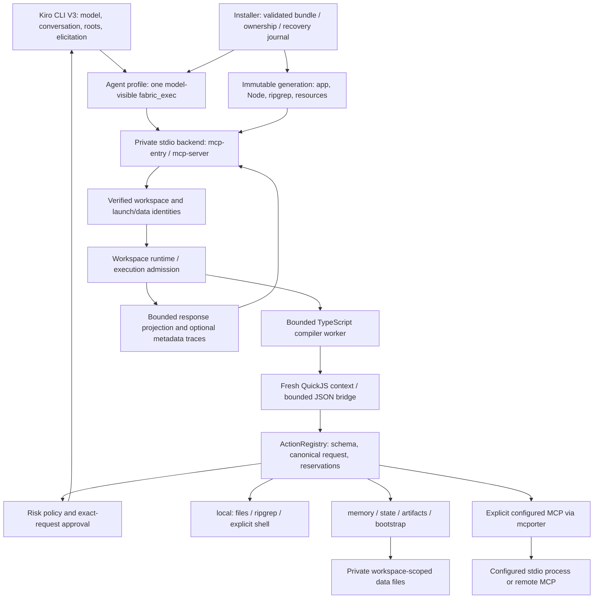
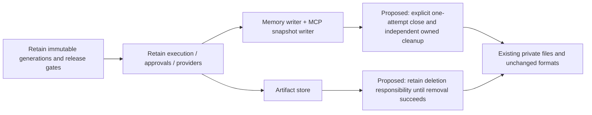

# Kiro Fabric — Repository Audit & Improvement Plan

Audit date: **2026-09-08, Europe/Warsaw** (execution and external retrieval timestamps use 2026-09-07 UTC). Audit and recommendations only; no implementation is authorized by this report.

**Subsequent remediation:** the user separately authorized fixing all findings. F-001 and F-002 are now fixed; see [implementation and validation](IMPLEMENTATION.md). This report retains the original pre-fix assessment, measurements and snapshot citations.

## 1. Executive Summary

**The inspected architecture supports targeted repairs, not a rewrite.** Kiro Fabric has a coherent separation between checked guest execution, host capability approval, workspace authority, persistence, and installed-generation management. The most important positive evidence is executable: isolated compiler/guest checks, approval rejection, workspace binding, and bounded shutdown passed component certification. The literal source-module graph had no detected cycles. These conclusions apply to the inspected paths and synthetic tests, not to every supported platform or an authenticated Kiro deployment. Evidence: `src/kiro/runtime.ts:42-78`, `src/execution-service.ts:108-179`, `src/core/action-registry.ts:178-252`; C-074, C-080.

Two **P2 – Medium, High-confidence** defects were substantiated:

| Finding | Consequence | Evidence |
|---|---|---|
| **F-001** | Memory temporary writes and staged MCP configuration retry a descriptor close after a completed-close I/O error. The retry masks the original error and skips file cleanup. | `src/kiro/memory.ts:588-611`; `src/kiro/mcp-provider.ts:188-238`; synthetic reproductions C-057, C-085 |
| **F-002** | Artifact deletion drops ownership and quota accounting before filesystem removal succeeds. A later close can report success while the file remains. | `src/kiro/artifacts.ts:124-134`; synthetic reproduction C-057 |

No P0 or P1 issue was established; immediate emergency containment is not supported by this evidence. Repair these failure paths before broadening distribution. The reproduced memory failure retained the previous committed value, and the residue stayed in private storage; neither broad data loss nor an external disclosure was demonstrated. C-057, C-085.

**The final full baseline check passed: all 873 tests in 65 files**, typecheck, build, staging, dead-code lint, component certification and application SBOM generation (C-100). Earlier attempts failed during audit environment provisioning. On the requested retry, the missing offline tarball was traced to the audit copy losing its pnpm store's `v11` suffix; correcting only that disposable layout made all 9 package-boundary tests pass, including clean consumer imports. No application or test change was needed. A fresh final build also passed in the disposable copy. C-056, C-084, C-096–C-101. The two audit-only fault probes still establish defects outside the existing tests' exercised failure cases.

**Release readiness remains unverified and explicitly blocked in the product.** The production signing root is absent; real Kiro tool inventory, compaction/resume behavior, and native macOS/ARM qualification have not been established here. Retain those gates. Component tests and a Linux x64 bundle using a fake Kiro contract cannot substitute for exact-artifact client qualification. `docs/installer.md:5-17`, `README.md:11-26`, `.github/workflows/release.yml:59-77`; C-054, C-056, C-068, C-080, C-095.

The recommended sequence is: add narrow regressions and fix F-001/F-002, retain the now-passing consumer/package checks, then complete the existing release qualification work if public distribution is intended. Performance optimization should follow representative measurements; this audit did not establish a production bottleneck or economic benefit.

## 2. Audit Scope & Provenance

### Inspected baseline and boundaries

| Item | Recorded state |
|---|---|
| Repository | `/home/adam/projects/kiro-fabric` |
| Branch / HEAD | `main`, tracking `origin/main`; `188e0277dbe35104dcd6ec803c7b2447f65c05e9` |
| History | Git reports non-shallow; no assertion that deleted remote refs or all historical repositories are available |
| Working tree | Dirty before the audit: tracked runtime/provider/installer/release/workflow/docs/test changes, generated closure replacement, and untracked installer modules/tests and previous audit material |
| Identity of reviewed bytes | [baseline.json](evidence/baseline.json) plus per-file hashes/modes/absence records in [baseline-manifest.json](evidence/baseline-manifest.json); HEAD alone is insufficient |
| Disposable execution copy | `/tmp/kiro-fabric-audit-a9qfi1km/repo`; 270 baseline files copied, with existing dependencies and private-tool caches; [snapshot.json](evidence/snapshot.json), C-015 |
| Output boundary | Only this new `audits/2026-09-08-repository-audit/` directory; original application, tests, configuration, lockfile and tracked `dist/` were preserved |
| Preservation check | C-090 and final C-102 report `non_audit_changes: []` against the original manifest |

The initial safety review and baseline were recorded before substantive code review in [AUDIT_NOTES.md](AUDIT_NOTES.md), C-001–C-016. Earlier audit reports and `tobechecked/` were not accepted as evidence for new findings. No production services, user MCP configuration, authentication, real-home installation, deployment, publication, push or commit were used.

Execution environment: Linux x64, kernel `6.17.0-1022-azure`, glibc `2.39`, Node `24.20.0`, pnpm `11.20.0`, Git `2.43.0`, host ripgrep `15.2.0`; the managed bundle pins its own ripgrep `14.1.1`. C-018–C-020, C-089, `build-toolchain.json:178-211`. No user duration or token ceiling was supplied. Commands were bounded; no daemon or indefinite benchmark was launched.

The initial OS sandbox could not initialize its loopback interface. Approved commands therefore ran without a claimed OS isolation guarantee. The audit used a disposable tree, reviewed scripts, synthetic child `HOME`/`KIRO_HOME`/temporary/cache paths, a sanitized environment, and Node-level network guards. Those guards are **not** a general native-process firewall. Public npm metadata/advisories and primary documentation were the only intentional external lookups. A first pnpm invocation tried to re-provision relocated dependencies; it was stopped, the disposable dependencies were restored, and automatic dependency preparation was disabled for subsequent audit commands. C-083 copied the existing pnpm store but inadvertently omitted its `v11` path suffix, causing C-084 to look in an empty nested store. The user's retry prompted C-096–C-098 to identify/correct that audit-only layout; C-099/C-100 then passed without changing repository inputs. Manifest verification covers enumerated project files; it does not prove that no unmeasured external cache changed. C-003, C-006, C-009, C-025, C-048, C-052–C-055, C-083–C-084, C-096–C-100.

`AGENTS.md:3-13` requires a fresh build. The task's stricter write boundary was honored by building in the disposable copy, including the final C-101 build. No commit was requested, and `pnpm run check` was used as baseline evidence, not as authorization to stage or commit.

### Coverage ledger

“Inventoried” means existence/size/import or search inspection; “statically traced” means actual callers, guards and error paths were read; “runtime” refers only to recorded cases. Executing a suite does not mean every assertion or production branch was independently reviewed. The [file ledger](evidence/coverage-ledger.json) preserves all inventoried authored paths and recorded source-read ranges without converting them into a coverage percentage.

| Component / paths | Depth reached | Evidence | Unfinished scope |
|---|---|---|---|
| Admission, compilation, QuickJS: `src/execution-service.ts`, `src/runtime/` | Critical request/host-call/settlement paths statically traced; compiler, guest, quota and deadline tests executed | C-023, C-026, C-030–C-034, C-070, C-088; C-056, C-080 | No exhaustive language/runtime security proof or representative load test; smaller stack-map/JSON helpers mostly inventory plus suite execution |
| Registry, approval, local capabilities: `src/core/`, `src/providers/local-*`, `src/providers/owned-file.ts`, `src/kiro/power/approver.ts` | Canonical request, reservations, approval and local effect paths traced; synthetic regression suites executed | C-024, C-026, C-034–C-037, C-047, C-060, C-092; C-056 | No malicious same-user filesystem-race containment or deliberate shell process-group escape testing |
| Entry, workspace, lifecycle: `src/kiro/mcp-entry.ts`, `mcp-server.ts`, `runtime.ts`, `power/workspace-*`, `power/data-paths.ts` | Startup/binding/runtime replacement/shutdown paths traced; component subprocess tests and certification executed | C-027–C-029, C-061, C-070, C-073, C-086–C-088; C-056, C-080 | Authenticated Kiro inventory, conversation, compaction and resume not run |
| Memory, state, artifacts: `src/kiro/memory*`, `artifacts.ts`, `src/providers/state-provider.ts` | Durable writes, locks, reads and cleanup paths traced; suite tests plus new audit-only fault probes | C-038–C-043, C-047, C-060, C-064, C-066, C-072, C-078, C-093; C-057, C-085 | Two confirmed cleanup defects; no physical power-loss/filesystem-matrix campaign |
| Configured MCP: `src/kiro/mcp-provider.ts` | Explicit config, staging, initialization, discovery, call and close paths traced; federation/pagination tests executed | C-061–C-066; C-056, C-085 | No production server, OAuth refresh, external authorization or remote side-effect rollback verification |
| Response/help/trace: `src/kiro/projection.ts`, bootstrap/catalog/providers, `src/trace/`, `scripts/trace-analyze.mjs` | Response caller and trace emission/writer paths traced; helpers/analyzer partly inventory; help probe and suites executed | C-029, C-062, C-067, C-070, C-072, C-077; C-056, C-082 | No client rendering/accessibility test; analyzer not fully traced independently |
| Managed install/recovery/trust: `install.sh`, `scripts/install-*`, `managed-installation.mjs`, `source-install.mjs`, archive/release modules, `src/installation/`, `src/kiro/managed-generation.ts` | Selected activation/recovery/ownership/signature/archive paths traced; lock implementation and legacy installer partly inventoried; synthetic/native Linux contract tests executed | C-014, C-044–C-046, C-049, C-051, C-054, C-068, C-071, C-087; C-056 | Exhaustive lock/recovery combinations, actual source-install onboarding, signed production acquisition, other native targets |
| Build, package, release and real-client tooling: `scripts/`, `package.json`, toolchain/configs, `.github/workflows/` | Lifecycle scripts inspected before execution; workflows read; package assertions and selected release guards traced; clean-consumer install/imports passed | C-010, C-012–C-014, C-022, C-065, C-068, C-078, C-091, C-095, C-104; C-056, C-079–C-081, C-099–C-100 | Large real-client driver/evidence validator inventoried, not completely audited; remote runs/protection/environments not inspected; full guest execution in extracted npm consumer not tested |
| `tests/`, docs, `skills/`, `resources/` | All significant paths inventoried; selected requirements/assertions read; all 873 tests in 65 files passed on the final full run | C-007, C-010–C-014, C-022, C-047, C-059, C-072, C-074, C-077–C-078, C-091, C-093–C-095; C-056, C-100 | No statement that all assertions were reviewed; prompt resources inventoried/package-validated, not adversarially evaluated |
| Generated/vendor/prior material | `dist/` inspected as packaging output; dependencies inspected as metadata/import/scanner subjects; previous audits excluded as conclusions | C-015–C-016, C-056, C-063, C-074–C-076, C-081 | No line-by-line vendor/WASM review; generated code excluded from authored-code size; previous audits and miscellaneous review notes not re-audited |

## 3. Project Understanding

### Purpose, requirements and architecture

The documented users are Kiro CLI V3 custom-agent users and JavaScript/TypeScript library embedders. Their principal use case is submitting checked TypeScript that coordinates bounded local coding, workspace memory/state and explicitly configured MCP capabilities through one model-visible `@fabric/fabric_exec` tool. Three raw stdio compatibility/operator endpoints remain. The actual user population, workload distribution and deployment scale are unknown. `README.md:3-13`, `package.json:1-14`, `src/kernel/index.ts:1-9`; C-010, C-017, C-086.

Explicit requirements include semantic checking before execution, no ambient host APIs in the guest, inner approvals independent of outer tool allowance, verified workspace identity, durable workspace memory/state, ephemeral overflow artifacts, and exact installed-generation binding. Kiro owns conversation history/compaction; Fabric must not manufacture evidence that a client preserves its process across those events. `SECURITY.md:7-13`, `docs/architecture.md:3-23`. The cleanup invariants in F-001/F-002 are supported by actual cleanup code and preservation/TTL tests; comprehensive behavior under every storage fault is not a supplied specification.

This is a Node/TypeScript library and local stdio backend, with a TypeScript compiler worker and embedded QuickJS/WASM guest runtime. Build/release/installer tools use ESM JavaScript, esbuild and TypeScript; tests use Vitest; Knip checks dead code. There is no repository-owned web frontend, SQL database, message broker, scheduled worker or serverless deployment in the inventoried entry graph. Persistence is private JSON/filesystem storage. MCP federation and Kiro are the significant external execution/service boundaries. C-010, C-059, C-074; `src/index.ts:1-54`, `src/kiro/runtime.ts:42-78`.



The diagram describes inspected composition, not a production topology: `scripts/agent-profile.mjs:1-70`, `src/kiro/mcp-server.ts:301-450`, `src/kiro/runtime.ts:42-78`, `src/execution-service.ts:108-301`, `src/core/action-registry.ts:178-252`; C-027–C-029, C-045–C-046, C-087, C-092. The inbound transport is stdio; configured outbound MCP can involve network or process execution.

Significant directories:

```text
src/
  core/                 Action descriptors, registry and semantic identity
  runtime/              TypeScript worker, QuickJS, JSON/source/deadline bounds
  providers/            Local capabilities and revisioned state
  kiro/
    power/              Compatibility-named workspace, approval and data helpers
    mcp-*.ts            Entry/server and configured downstream federation
    memory*.ts          Workspace memory; artifacts.ts holds ephemeral results
  installation/         Shared installed bundle/lock contracts
  trace/                Optional bounded metadata events and JSONL writer
  kernel/               Model-facing execution registration/contract
scripts/                Build, installer, archive, certification and release tools
tests/                  Unit, integration, subprocess and package contract tests
docs/architecture/      Machine-readable reachability baseline
skills/fabric-exec/      Bundled usage instructions and API reference
resources/steering/     Bundled agent steering
.github/workflows/      CI, candidate, authenticated qualification, release
dist/                   Generated library and private Agent closure
```

Inventory evidence: C-007, C-015–C-016, C-059, C-074. Compatibility names containing `power` do not establish a second product; `docs/architecture.md:7` and runtime registration support that distinction.

### Critical-flow traces

These flows were prioritized because they mediate untrusted guest input, privileged effects, shared durable data or executable release material. Historical changes also concentrate around the server, execution service, registry and workspace binding. C-016.

1. **Guest request to effect and response.** The stdio server resolves a verified binding and obtains its runtime. Admission rejects a closed/saturated service before compilation; source and payload budgets are checked. A service-owned compiler performs semantic checking before QuickJS executes. The JSON bridge routes host calls through the registry, which validates/canonicalizes arguments, binds descriptors, reserves conflicting writes, obtains exact approval and awaits provider settlement. Output is bounded and projected; completed earlier effects are not rolled back by a later guest failure. `src/kiro/mcp-server.ts:335-450`, `src/execution-service.ts:108-301`, `src/runtime/type-checker.ts:175-263`, `src/core/action-registry.ts:178-283`; C-023–C-034, C-070, C-080, C-092.
2. **Workspace identity to durable data.** Roots/launch authority select a canonical workspace; data-path helpers derive its private namespace. Runtime composition makes local/memory/state unavailable without the required binding. Memory mutations validate records under a namespace mutation lock and write an fsynced temporary file before rename. State uses revision checks, a mutation lock and atomic persistence. Selected cross-process/crash tests passed. Memory's temporary writer has F-001; a different existing owned-file helper already models uncertain close correctly. `src/kiro/power/data-paths.ts:197-333`, `src/kiro/runtime.ts:51-68`, `src/kiro/memory.ts:588-611`, `src/kiro/memory.ts:734-782`, `src/providers/state-provider.ts:110-238`, `src/providers/owned-file.ts:8-35`; C-038–C-043, C-047, C-056, C-061, C-087, C-093.
3. **Configured MCP discovery/call.** Explicit private configuration is validated and captured in a content-bound snapshot; initialization is lazy. Executable/network/OAuth-related stages are subject to their relevant approval policy. Discovery follows bounded opaque cursors and call operations share deadlines/leases; close and cancellation paths preserve failure information instead of assuming a remote effect was undone. The snapshot close error has the same F-001 root cause. `src/kiro/mcp-provider.ts:188-238`, `src/kiro/mcp-provider.ts:449-590`, `src/kiro/mcp-provider.ts:695-815`, `src/kiro/mcp-provider.ts:816-1024`; C-061–C-066, C-056, C-085. No live federation was exercised.
4. **Candidate installation to activation/recovery.** Source mode builds the current trusted checkout; release mode requires production trust. Bundle/archive validation precedes activation. Managed installation validates prior ownership and uses a recovery journal for control-file replacement. A published commit is distinguished from pre-commit failure; retained generations keep existing sessions and rollback available. This is recovery across individually replaced files, not one atomic multi-file transaction. `scripts/source-install.mjs:1-39`, `scripts/managed-installation.mjs:112-193`, `scripts/install-transaction.mjs:47-76`, `src/kiro/managed-generation.ts:1-100`; C-045–C-046, C-049, C-051, C-054, C-071. Runtime evidence is synthetic/native Linux contract testing, including installed independence with fake Kiro: C-056.

### Configuration, entities and state ownership

| Boundary / entity | Inspected representation and implications |
|---|---|
| Launch/configuration | `KIRO_HOME`, installer-owned `KIRO_FABRIC_RUNTIME_ROOT` and `KIRO_FABRIC_DATA_ROOT`; debug via `KIRO_FABRIC_DEBUG`. Managed launch also checks expected private Node identity. Config lives at `config/config.json` and sibling `mcp.json` under the private data root. These are names/layouts, not discovered user values. `src/kiro/power/agent-launch-context.ts:1-44`, `src/config.ts:260-344`, `src/kiro/mcp-server.ts:301-335`; C-061, C-073, C-086. |
| Configuration schema | Version 1 with validation of fields/types; a valid legacy unversioned file can be migrated in memory without rewriting it. File identity/privacy checks constrain loading; normalization is a separate library entry concern. `src/config.ts:138-240`, `src/config.ts:260-344`; C-061, C-073; configuration/migration suites in C-056. |
| Capability / approval | Provider/action/schema/risk/descriptor identity and canonical arguments; write reservations and approval counters belong to executing services/registries. Read risk defaults to allow, writes/execute/network to ask; this is configurable policy. `src/config.ts:85-108`, `src/core/action-registry.ts:178-252`, `src/kiro/power/approver.ts:105-140`; C-092. |
| Durable memory/state | Memory entries bind namespace/key/value/update timestamp; state entries use revisions and compare-and-set semantics. Multiple chats on the same verified workspace intentionally share these files. Formats and ownership are validated before mutation. `src/kiro/memory.ts:734-780`, `src/providers/state-provider.ts:1-90`, `src/providers/state-provider.ts:110-238`, `docs/architecture.md:19-21`; C-038–C-043, C-086. |
| Artifact | Process-owned full-result content, disk file, last-read time and quota entry; default idle TTL one hour, default total 8,000,000 characters. The store is ephemeral, not conversation memory or a backup. `src/config.ts:116-121`, `src/kiro/artifacts.ts:99-134`; C-043, C-092–C-093. |
| Installation | Immutable bundle identity, ownership/control identities, recovery journal, and stable-release high-water state. Rollback switches retained code/resources and does not rewind durable user data or release anti-downgrade state. `scripts/managed-installation.mjs:112-193`, `scripts/install-transaction.mjs:47-76`, `docs/installer.md:39-55`; C-045–C-046, C-049, C-071, C-091. |

Workspace files, memory/state, full artifacts, downstream configuration and execution error responses can contain sensitive data. Traces normally contain bounded metadata, but identifiers/custom embedder events are not guaranteed anonymous. No encryption-at-rest or backup service was established; private filesystem permissions and the local-user trust model are the observed controls. `src/trace/tracer.ts:1-167`, `src/trace/trace-writer.ts:1-74`, `docs/tracing.md:3-17`; C-062, C-067. SQL indexes/migrations, queue delivery and browser session mechanisms are Not applicable to this architecture.

### Measured inventory and Git signals

| Authored category | Files | Physical lines | Bytes |
|---|---:|---:|---:|
| `src/` TypeScript/ESM | 48 | 9,683 | 477,229 |
| `scripts/` ESM | 38 | 8,284 | 512,773 |
| `tests/` TypeScript | 67 | 11,785 | 708,478 |
| `docs/` Markdown | 8 | 610 | 84,631 |
| Workflows | 4 | 322 | 13,774 |

C-016 counts dirty-baseline regular files, including blank/comment lines. Categories exclude generated `dist/`, dependencies, previous audits and miscellaneous review notes; root Markdown and configuration are inventoried separately, not included in the docs subtotal. Tests comprise 65 `.test.ts` files and two support files (C-074). No cyclomatic complexity or line/branch coverage was measured.

The available all-ref history contains **95 commits**, dated August 28–September 8, 2026; this describes the available repository history, not product age. Two author labels account for 84 and 11 commits; aliases/bots are unreconciled, so this is not a team-size or ownership estimate. Existing source path touches include `mcp-server.ts` 21, `execution-service.ts` 17, `runtime.ts` 14, registry/workspace-binding 13 each, and config/MCP provider 11 each. Renames and deleted historical paths are not reconciled. C-016, [metrics.json](evidence/metrics.json).

The largest authored file is the real-client driver (2,724 physical lines); the legacy installer has 1,094, MCP provider 1,024, memory 874 and QuickJS runtime 693. Size alone is not a defect. Material review hotspots are memory and MCP staging because F-001 shows inconsistent close ownership, and artifacts because F-002 loses deletion responsibility. The large real-client driver is a future review priority because it controls release evidence and remains incompletely inspected, not because a replacement has been justified. C-016, C-043, C-061–C-066, C-093.

The build reported an Agent closure of **78 files / 14,582,707 bytes / 46 source modules**, and a complete Linux x64 bundle payload of **148,014,935 bytes**, including private Node/ripgrep. Three baseline generated chunks exceed 1 MB. These are distribution/runtime measurements, not frontend bundle or latency findings; no authored file over 1 MB appeared in the measured categories. C-016, C-056.

## 4. Scorecard

Scores are qualitative: 1 serious evidenced deficiencies; 2 substantial weaknesses; 3 mixed/adequate with material gaps; 4 strong within inspected scope with limited material issues; 5 consistently strong and well-supported within inspected scope. Missing evidence is Not assessed, not an automatic low score. No overall average is calculated.

| Dimension | Score | Rationale / evidence | Confidence and scope |
|---|---:|---|---|
| Architecture | 4 | Distinct compiler/guest/registry/provider responsibilities, explicit workspace composition; no cycles in the measured literal runtime graph. `src/kiro/runtime.ts:42-78`; C-023–C-034, C-074 | High for composition; excludes full driver/vendor architecture |
| Correctness | 3 | All existing tests pass, but the independent fault probes establish two storage error-path defects. F-001/F-002; C-057, C-085, C-100 | High for identified defects; deployment-wide correctness unverified |
| Code Quality | 3 | Strict TS checks and clean Knip run; uncertainty-aware owned-file helper is a good example, while adjacent temporary writers fail to apply the same invariant. `src/providers/owned-file.ts:8-35`; C-010, C-079; F-001/F-002 | Medium; no measured complexity or comprehensive style audit |
| Testing | 4 | Broad unit/component/process/install tests, meaningful error and CAS tests, explicit fake-client boundary. C-056, C-072, C-078, C-093 | Medium; no coverage %, repeated flake campaign, authenticated client or native platform proof |
| Security | 4 | Examined guest isolation, exact effect approvals, private config/path checks and production trust gate are specific controls; component assertions passed. `src/core/action-registry.ts:178-252`, `src/kiro/power/approver.ts:105-140`; C-054, C-061, C-080 | Medium; scoped to inspected controls, not penetration testing, external authentication or complete dependency assurance |
| Performance | Not assessed | One cold help execution and fixture preparation are insufficient to grade production latency/capacity against unknown targets. C-082 | High confidence in this evidence limit |
| Reliability/Ops | 3 | Bounded lifecycle, recovery journals and committed-error handling, with two cleanup weaknesses. `scripts/install-transaction.mjs:47-76`; C-056, C-080; F-001/F-002 | Medium; no power-loss, backup restore or platform qualification campaign |
| Dependencies | 4 | Small used direct runtime set, lockfile/build-script restrictions, supported Node LTS, zero scanner advisories at retrieval and passing clean-consumer imports. C-010, C-063, C-074–C-076, C-099–C-100; W-001 | Medium; licenses are metadata-level, maintenance guarantees unknown; platform-specific execution remains qualified separately |
| Documentation/DX | 4 | Docs distinguish component evidence, production blockers, non-atomic activation and rollback limits; commands map to inspected scripts. `README.md:15-60`, `docs/installer.md:5-55`; C-051, C-068, C-091 | Medium; real onboarding and client UI/accessibility untested |

## 5. Feature Verification Matrix

Confidence refers to the stated result and scope, not to untested production behavior. C-056 and the fully passing C-100 are suite evidence; only the explicitly listed source/test ranges were independently read. “Explicit” denotes a documented requirement; “inferred” denotes an implementation invariant whose basis is stated.

| Feature | Requirement source | Inspected scope / source evidence | Method / commands or tests | Status | Confidence | Unresolved cases |
|---|---|---|---|---|---|---|
| FV-01 Checked execution and no ambient guest host APIs | Explicit: `SECURITY.md:7-9` | Admission → compiler → fresh QuickJS → bridge; `src/execution-service.ts:108-179`, `src/runtime/type-checker.ts:175-263`, `src/runtime/quickjs-runtime.ts:354-540` | Static trace; C-056 compiler-isolation/quickjs/strict-bootstrap suites; C-080 checked execution, dynamic-code denial, compiler filesystem isolation | Verified within tested scope | High | Full JS/WASM/host attack surface and arbitrary embedder hooks not proved |
| FV-02 Bounded admission, provider calls and settlement | Explicit: `docs/configuration.md:7-20` | Service admission/release and bridge counters; `src/execution-service.ts:108-129`, `src/execution-service.ts:180-301`, `src/execution-service.ts:377-385` | Static trace; C-056 execution-admission/deadline/approval-quotas suites; C-080 shutdown | Verified within tested scope | High | Limits are per service, not a global capacity guarantee; remote effects may already have occurred |
| FV-03 Exact inner effect approval | Explicit: `README.md:7-13`, `SECURITY.md:9-13` | Canonical arguments, reservations, policy, default-false elicitation; `src/core/action-registry.ts:178-252`, `src/kiro/power/approver.ts:18-63`, `src/kiro/power/approver.ts:105-140` | Static trace; C-056 approval suites; C-080 form decline and approval boundary | Verified within tested scope | High | Real Kiro form display/dismissal and arbitrary downstream authorization not established |
| FV-04 Workspace authority and runtime binding | Explicit: `docs/architecture.md:5-19` | Launch context, roots, data identity, provider availability; `src/kiro/power/agent-launch-context.ts:1-44`, `src/kiro/runtime.ts:51-68` | Static trace C-061/C-073/C-087; C-056 workspace-binding/managed-generation; C-080 workspace binding | Verified within tested scope | High | Malicious same-user filesystem mutation is outside claimed OS confinement |
| FV-05 Local read/search/write/edit/shell | Explicit: `README.md:7-9`; confinement limits `SECURITY.md:11` | Path resolution, write reservation, canonical review and process cleanup; `src/providers/local-path.ts:1-113`, `src/providers/local-provider.ts:235-503`, `src/providers/local-shell.ts:1-170` | Static trace C-034–C-037; local-provider/shell/lock/search/diagnostic suites in C-056 | Verified within tested scope | Medium | Actual project toolchains, cross-platform signals, intentional shell escape and hostile same-user races not tested |
| FV-06 Revisioned workspace state and restart durability | Explicit: `docs/architecture.md:19-23` | State mutation/atomic write/revisions; `src/providers/state-provider.ts:110-238`, `tests/storage-failure.test.ts:94-104` | Static trace; C-056 state-reliability, storage-failure and MCP process lifecycle; selected assertions C-047/C-093 | Verified within tested scope | High | Physical power loss, network filesystems and complete recovery-state combinations |
| FV-07 Memory temporary-write error cleanup | Inferred resource ownership/primary-error invariant; writer and error-path assertions in `tests/memory-acknowledgement.test.ts:1-65` | `src/kiro/memory.ts:588-611`, caller `src/kiro/memory.ts:734-782` | Static trace; synthetic completed-close EIO, C-057; ordinary memory suites C-056 | Confirmed defect | High | F-001; real-world frequency and OS-specific close semantics beyond Linux unknown |
| FV-08 Explicit configured MCP discovery/calls | Explicit: `docs/configuration.md:3-20` | Configuration staging, lazy initialization, schemas/cursors/deadlines; `src/kiro/mcp-provider.ts:188-238`, `src/kiro/mcp-provider.ts:449-590`, `src/kiro/mcp-provider.ts:695-815` | Static trace C-061–C-066; federation/pagination suites C-056; staging fault C-085 | Partially verified | High | F-001 also affects staging; no production connections, OAuth refresh or remote-effect reconciliation |
| FV-09 Artifact expiration and shutdown cleanup | Explicit ephemeral storage: `docs/architecture.md:19`; expected deletion: `tests/artifacts-state.test.ts:44-82` | `src/kiro/artifacts.ts:99-134` | Static trace and ordinary tests C-056; transient deletion fault C-057 | Confirmed defect | High | F-002; success-path TTL works in exercised tests, transient failure loses cleanup ownership |
| FV-10 Metadata-only bounded routine traces | Explicit: `docs/tracing.md:3-17` | Execution/bridge hooks and bounded trace writer; `src/trace/tracer.ts:1-167`, `src/trace/trace-writer.ts:1-74` | Static trace C-062/C-067/C-070; tracing/analyzer suites C-056 | Verified within tested scope | Medium | Custom embedder events, identifiers and client error rendering may still be sensitive; no complete analyzer audit |
| FV-11 Immutable installed generations and recovery | Explicit: `README.md:52-60`, `docs/installer.md:39-55` | Bundle validation, ownership/journal activation, retained generation and launcher; `scripts/managed-installation.mjs:112-193`, `scripts/install-transaction.mjs:47-76` | Static trace; C-056 transaction/managed-installation/installed-independence tests | Partially verified | High | Fake Kiro contract; no authenticated client or complete production/native target qualification |
| FV-12 Reject unsigned production acquisition | Explicit: `docs/installer.md:5-17`, `docs/installer.md:33` | Production trust loading, signed metadata and bootstrap guards; `scripts/release-trust.mjs:1-52`, `scripts/generate-installer-bootstrap.mjs:178-192` | Static trace C-054/C-068/C-104; release-trust/bootstrap suites C-056/C-100 | Verified within tested scope | High | Production key and successful exact-artifact release path absent; this result establishes rejection, not release readiness |
| FV-13 Complete Kiro tool inventory, compaction and resume | Explicit: `README.md:11`, `docs/release.md:25-35` | Contract/workflow requirements; real driver only partial inventory | Docs/workflow inspection C-091/C-095; authenticated command not run | Not verified | High | Requires authorized isolated real Kiro session and exact candidate; process-component certification is insufficient |
| FV-14 Fresh npm library consumer | Explicit package export contract: `package.json:1-32`; `tests/package-boundary.test.ts:175-250` | Pack contents, frozen offline production install into unrelated tree, six direct dependency imports and exported server factory | C-099: 9/9 boundary tests pass after correcting audit store layout; C-100 full check; assertions read in C-078/C-104 | Verified within tested scope | High | Import/export smoke on Node 24/Linux x64; full guest/worker execution inside the extracted consumer and other platforms were not exercised by this test |
| FV-15 Native macOS/ARM installation | Explicit targets with pending qualification: `README.md:24-26` | Target metadata and configured CI matrix; `.github/workflows/ci.yml:46-104` | Static configuration review C-091/C-095; no matching hardware runs | Not verified | High | Native binaries, quarantine/resources, signals, locks and installed execution |
| FV-16 Bounded bundled help | Explicit: `README.md:9` | Built library help execution/paging; `scripts/efficiency-baseline.mjs:124-173` | C-082: one fresh-service execution, two complete API pages; info-catalog suite C-056 | Verified within tested scope | High | MCP projection/client display not included in that probe; other topics not independently probed |
| FV-17 Web frontend, SQL migrations and queue processing | No such first-party entry/storage model in inventory | C-059/C-074; composition `src/kiro/runtime.ts:42-78` | Entry/dependency/persistence inventory and selected traces | Not applicable | High | Would need reassessment if a web/service deployment is added |

## 6. Detailed Findings

### Phase 2 — Correctness & Implementation Verification

#### F-001 — Retrying an uncertain close masks the storage error and strands temporary files

- **Classification:** Confirmed finding; primary phase 2; related reliability, resource ownership, diagnostics and sensitive-config retention. Memory and MCP staging are one finding because the faulty ownership transition and remedy are the same.
- **Severity and urgency:** **P2 – Medium.** Material but conditional cleanup/diagnostic failure after an I/O error. Fix in the next maintenance work and before broader distribution. No emergency containment is indicated: the demonstrated memory operation failed without replacing its previous committed value, and no public disclosure or broad availability failure was observed.
- **Confidence:** **High.** Both unchanged-source implementations were traced through callers and safely reproduced with the same completed-close EIO simulation.
- **Evidence:** `src/kiro/memory.ts:588-611` opens/writes/fsyncs a temporary file, closes at line 599, and only then clears the descriptor at line 600. Its catch closes again at line 606 before removal at line 608. `src/kiro/memory.ts:734-782` shows the public set path reaching this helper. `src/kiro/mcp-provider.ts:188-238` repeats the ordering at lines 217–218 and 227, before identity-aware snapshot cleanup. C-057 observed two close attempts, returned `EBADF`, retained value `before`, and one temporary file. C-085 observed two close attempts, `EBADF`, and one retained snapshot from an empty synthetic MCP config. No server connection or real credentials were used.
- **Expected versus observed:** The inferred invariant is one close attempt after descriptor ownership becomes uncertain, preservation of the primary error, and an independent attempt to clean up owned temporary material. The current paths assume a throwing close leaves the descriptor open. The synthetic close actually released it and then threw EIO; the second close threw EBADF, bypassing the remaining cleanup and the original rethrow. Linux documents that a close error may arrive after descriptor release, so this is a supported failure model, not an invented requirement. [Linux close(2), error-return caveats](https://man7.org/linux/man-pages/man2/close.2.html), W-002, retrieved 2026-09-07 UTC.
- **Conditions and impact:** Reachable on an affected memory write or MCP snapshot initialization if close reports an error after release; a cleanup close error following another write/fsync error can likewise preempt later cleanup. It can leave private values/configuration on disk and obscure the actionable I/O cause. The Linux manual also describes possible descriptor reuse hazards; **unrelated-descriptor closure was not reproduced and is not used to elevate severity**. No production incident frequency was measured. Old committed memory survived the probe, exclusive/private file creation remains present, and existing memory recovery/acknowledgement suites passed (C-056).
- **Recommendation:** Make the descriptor's transition to uncertain/closed ownership happen before the first close attempt, and ensure temporary cleanup and error reporting execute independently. Reuse or narrowly adapt the existing `initializeOwnedFile` pattern in `src/providers/owned-file.ts:8-35`, or implement the same small explicit state transition locally. Preserve MCP's exact-file-identity cleanup and foreign-file protection. Aggregate secondary cleanup errors with the original cause where appropriate; never silently turn an uncertain effect into success. Avoid a new general storage framework.
- **Compatibility:** No file-format, namespace or API-input migration is needed. Preserve commit acknowledgement semantics and public failure status; changing error wrapping/text may require adapting existing assertions and downstream error display. Do not blindly retry a possibly committed higher-level operation.
- **Validation — proposed, not executed as a fix:** Add ordinary repository regressions simulating close-then-EIO in both paths, write/fsync failure plus cleanup failure, old-value preservation, no owned residue after recovery, and preservation of a foreign replacement path. Accept only one close attempt, original cause retained, independent cleanup attempted, and successful subsequent operations after transient faults are removed. Re-run relevant memory/MCP/storage suites, `pnpm run check`, and a fresh build. The audit probes in [storage-faults.mjs](probes/storage-faults.mjs) and [mcp-close-fault.mjs](probes/mcp-close-fault.mjs) currently reproduce the unfixed defect.
- **Effort:** **S**, assuming the current file formats, Linux/macOS contract and error envelopes remain; several local changes plus focused failure-path tests.

### Phase 7 — Reliability, Operations & Observability

#### F-002 — Artifact deletion forgets the file before removal succeeds

- **Classification:** Confirmed finding; primary phase 7; related correctness, retention and quota accounting. Separate from F-001 because the lost state is deletion ownership, not descriptor-close ownership.
- **Severity and urgency:** **P2 – Medium.** A transient filesystem failure can leave full-result files beyond normal cleanup and make subsequent shutdown falsely appear complete. Address with F-001 before broadening distribution. No immediate containment is warranted by the private, bounded demonstration.
- **Confidence:** **High.** Direct state-transition trace plus a synthetic failure/recovery sequence reproduces the consequence.
- **Evidence:** `src/kiro/artifacts.ts:124-134` deletes the map entry and subtracts its character count before `fs.rmSync`. Callers include write eviction, read-triggered TTL sweep and close: `src/kiro/artifacts.ts:70-75`, `src/kiro/artifacts.ts:99-117`. C-057 injected one temporary artifact-removal EIO during sweep, restored the filesystem function and called close: `successfulClose: true`, `remainingFiles: 1`. Expected success-path expiry/removal and other-store preservation are explicitly asserted in `tests/artifacts-state.test.ts:44-82` (C-056, C-072, C-093).
- **Expected versus observed:** Once the store owns a disk artifact, deletion responsibility and capacity accounting should survive an unsuccessful removal until cleanup succeeds or a durable/explicit unresolved state is reported. Instead, the first failed deletion irreversibly removes the in-memory record, so later sweep/close has nothing to retry. This expectation extends the existing successful-close/TTL behavior to transient I/O failure; it is not a requirement for permanent storage of artifacts.
- **Conditions and impact:** Requires disk-backed artifacts and a failed removal, such as a transient EIO or permission/storage failure. Full results may remain privately on disk despite later successful close; forgotten files are no longer counted in this store's quota. Repetition could accumulate residue, but no accumulation rate or disk-exhaustion incident was measured. Mitigations: files are private and startup reclaims eligible residue older than 24 hours, rather than importing another process's fresh artifacts. That does not repair cleanup within the original process and requires a later startup. `src/kiro/artifacts.ts:44-65`; C-057, C-093.
- **Recommendation:** Retain deletion ownership and relevant quota accounting until removal succeeds, or use a small explicit pending-deletion collection if serving/expiry state must be separated. A failed owned deletion must prevent an unqualified successful close. Preserve expiry behavior so an expired artifact is not served merely because its removal failed, and preserve other processes' files. No storage engine or background service is needed.
- **Compatibility:** Public paging/ID formats and persistent layouts can remain unchanged. Failure behavior becomes more accurate; callers may observe repeated cleanup errors until recovery instead of a false success. Avoid changing ordinary idle-TTL semantics.
- **Validation — proposed, not executed as a fix:** Exercise transient and persistent removal errors through sweep, eviction and close. After restoring removal, a subsequent cleanup must remove the owned file; before recovery, it must retain responsibility and not falsely report complete shutdown. Verify quota accounting, expired-read rejection, independent artifacts and foreign-file preservation. Extend `tests/artifacts-state.test.ts` or the existing storage-failure tests; re-run relevant suites, full check and build.
- **Effort:** **S**, assuming process-local bookkeeping and current public contracts are retained.

### Hypotheses and non-findings

No additional hypothesis is promoted to a finding. Synchronous JSON/fsync paths and large allowed configurations warrant measurement if workload targets demand it, but this audit did not establish a material bottleneck. Missing production signing and real-client qualification are documented incomplete release requirements, not evidence of a signature bypass. File size, compatibility naming and older-than-latest package versions are not defect severities.

## 7. Testing, Security, Performance, and Dependency Summaries

### Testing and quality assurance

| Check | Recorded result and interpretation |
|---|---|
| **Final `pnpm run check`** | **C-100 passed**, 181.301 s, after correcting only audit dependency-store layout. **873/873 tests, 65/65 files passed**, Vitest duration 161.04 s; typecheck, build, staging/complete Linux bundle, Knip, 14-check component certification and 29-package application SBOM all completed in this same command. |
| `pnpm run check`, first attempt | C-025 failed with SIGTERM after 447.559 s during automatic dependency preparation. Typecheck/tests were not reached. This was a relocated-dependency/network limitation. |
| `pnpm run check`, provisioned dependencies | C-056 failed overall, 214.600 s. Typecheck/build/staging/complete Linux bundle passed. Vitest: 872 passed, 1 failed / 873; 64 passed, 1 failed / 65 files; Vitest duration 198.53 s. Failure was the consumer offline install's 60 s timeout while metadata requests were blocked. Later chained lint/certification/SBOM stages did not execute in this command. |
| Focused package diagnostic and requested retry | C-084 originally reported 8 passed / 1 failed with `ERR_PNPM_NO_OFFLINE_TARBALL`. C-096/C-097 showed that audit relocation had lost the store's `v11` suffix, so pnpm used an empty nested store. C-098 corrected only the disposable path/metadata. **C-099 then passed all 9 tests**, including installed-consumer imports; no application/test/dependency-version change was needed. |
| Dead-code lint | C-079 passed (`knip`). No dead-code finding is inferred solely from search, names or compatibility exports. |
| Component MCP certification | C-080 passed 14 checks, explicitly `component-mcp-only`; includes three backend endpoints, six providers, approval decline, compiler isolation and bounded shutdown. It is not a model inventory or Kiro lifecycle certificate. |
| SBOM | C-081 passed, 29 packages in the application-closure SBOM. This command is not a complete private-binary license review or successful signed-release SBOM promotion. |
| Final fresh build | C-101 passed in the disposable copy. Original tracked output was not rebuilt in place. |

The suite contains unit/contract tests for JSON/schema/config/registry behavior, provider/file integration tests, stdio subprocess lifecycle tests, and installer/archive/package tests. Representative error-path assertions inspect committed revisions after failed cleanup and exact old/new state, rather than only matching a mocked return value: `tests/storage-failure.test.ts:94-104`, `tests/memory-acknowledgement.test.ts:1-65`. Installed independence explicitly uses a fake Kiro contract, a useful packaging check with a clear limit: `tests/installed-independence.test.ts:1-130`; C-022, C-056, C-078, C-093.

Vitest uses Node, mock restoration, serial test files and default 30 s test/hook timeouts (`vitest.config.ts:1-12`, C-010). Platform-dependent markers were reviewed: Linux-only lock cases and a Linux/macOS shell case; none was reported skipped in the Linux full run. C-074, C-077. No snapshot assertion or property-testing framework marker was found by the bounded explicit search; that is a search result, not proof that no hand-written generative test exists. No TODO/FIXME/HACK/STUB matches were found in that same scoped search. `rg` returned 1 for no matches (C-094), not a failing application check. No unfinished-path defect is inferred.

Coverage was **not run**: a coverage provider was absent, and adding dependencies was outside the audit write contract. No coverage percentage is reported. The full suite was rerun to resolve the failed baseline, not repeatedly shuffled or stress-run; determinism/order independence and flake rates remain unmeasured. The test-install failure was an audit provisioning error resolved by C-098, not a repository defect or established flake. C-074, C-084, C-096–C-100.

Configured CI runs on main pushes, PRs and manual dispatch, with frozen dependencies, advisory audit, full check, archive reproducibility and diff checks. The native matrix lists Linux/macOS x64/arm64 and explicitly distinguishes contract tests from qualification. The authenticated workflow is manual, requires a protected default ref and trusted self-hosted runner/environment; release verifies tag/commit and requires exact-commit evidence. These are configured guards, not proof of remote execution or enforced branch/environment protection. `.github/workflows/ci.yml:3-44`, `.github/workflows/ci.yml:46-104`, `.github/workflows/kiro-agent-real.yml:3-44`, `.github/workflows/release.yml:16-77`; C-095.

Prioritized gaps: regression coverage for F-001/F-002 and authorized exact-artifact Kiro/native qualification (FV-13/FV-15). Preserve the successful consumer install/import check (FV-14); full guest execution in an extracted consumer remains a narrower optional extension. A broad coverage-percentage project is not a prerequisite for the two repairs.

### Security and operational controls

| Boundary / asset | Specific observed controls | Limits / next evidence |
|---|---|---|
| Model-supplied code → host | Semantic compiler isolation, fresh QuickJS context, bounded JSON bridge, registry schema/identity checks and inner approvals. `src/runtime/type-checker.ts:175-263`, `src/core/action-registry.ts:178-252`; C-030–C-034, C-080 | Guest sandbox claims do not confer OS confinement on explicitly approved shell/MCP capabilities. Vendor/WASM internals not audited. |
| Workspace files and local process execution | Canonical path/identity checks, cooperating effect locks, exact review material, bounded output and process cleanup. `src/providers/local-path.ts:1-113`, `src/providers/local-provider.ts:235-503`, `src/providers/local-shell.ts:1-170`; C-034–C-037, C-056 | Shell cwd is not confinement; same-user adversarial races and deliberate process-group escape are explicitly outside the guarantee (`SECURITY.md:11`). |
| Private configuration and downstream credentials | Explicit bounded config files, private ownership/modes and snapshot binding; conservative shell environment filtering. `src/kiro/mcp-provider.ts:95-238`, `src/providers/local-shell.ts:1-107`; C-061, C-088 | F-001 can retain a private config snapshot. Live OAuth/token storage/refresh/rotation and external server permissions were not tested. |
| Persistent user content and diagnostics | Workspace namespaces, ownership/format validation, mutation locks, CAS state, private artifacts and bounded metadata traces. C-038–C-043, C-062, C-067, C-086–C-087 | F-002 weakens artifact cleanup. Raw execution responses/custom trace hooks can be sensitive; no general log sanitizer or verified backup service was established. |
| Release/installer execution | Pinned private tool metadata, bounded archive consumer, signed release metadata checks, validated recovery identities and retained generations. C-014, C-045–C-046, C-054, C-068, C-071 | Production trust root/qualification remain absent. Local ownership hashes are not publisher signatures. No signed production acquisition or release was performed. |
| Availability/lifecycle | Admission/call/approval/JSON/heap/deadline limits, runtime draining, component parent/EOF/process tests; C-056, C-080; `src/execution-service.ts:108-129`, `src/kiro/mcp-entry.ts:58-100` | Limits are not global across arbitrary service creation. Cancellation does not reverse settled host/remote effects. Crash recovery tests are not physical power-loss or backup/restore proof. |
| Web/account/tenant controls | No first-party HTTP account frontend or multi-tenant service entry in inventory; Kiro owns authentication and conversation. C-059/C-074; `docs/architecture.md:11-23` | First-party MFA, password brute-force, CSRF, XSS, CORS, clickjacking and browser cookie checks are Not applicable. Configured remote services require their own review. |

A bounded high-specificity secret scan checked **188 current authored text files / 1,995,614 bytes** and **1,954 unique eligible historical blobs / 24,631,066 bytes** across available refs. It found zero candidates for private-key headers, GitHub tokens, AWS access-key IDs and Slack tokens; no bound was exhausted. This excludes generated/dependency/prior-audit content and is not entropy analysis or an exhaustive secret audit. No candidate values were printed and no credentials were validated. C-075; [secret-scan.py](probes/secret-scan.py).

`pnpm audit --audit-level moderate --json` returned zero advisories across 301 scanner entries (C-063). Dependency categories overlap; 126 dependencies, 160 development and 115 optional must not be summed as distinct packages. Three primary SDK advisories were also checked: the resolved direct SDK `1.30.0` falls outside the affected ranges for [shared server/transport data leakage](https://github.com/modelcontextprotocol/typescript-sdk/security/advisories/GHSA-345p-7cg4-v4c7) (W-003), [UriTemplate ReDoS](https://github.com/modelcontextprotocol/typescript-sdk/security/advisories/GHSA-cqwc-fm46-7fff) (W-004), and [HTTP localhost DNS rebinding defaults](https://github.com/modelcontextprotocol/typescript-sdk/security/advisories/GHSA-w48q-cv73-mx4w) (W-005). The last advisory also excludes stdio; the inspected inbound transport is stdio (`src/kiro/mcp-entry.ts:1-100`). No current application security finding is inferred from those historical advisories. Zero scanner matches are not a security clearance or proof about unknown vulnerabilities.

No security-specific CWE/OWASP label is assigned to F-001/F-002: demonstrated resource/retention consequences are sufficient, while an externally reachable security exploit was not established. Existing bounded tracing/info and shutdown fit a local process model; HTTP liveness endpoints, circuit breakers, distributed redundancy and queue dead-letter systems have no evidenced requirement here.

### Performance and scalability

| Observation | Method and scope | Interpretation |
|---|---|---|
| One cold bounded-help execution: **782.465206 ms**, **9,813 returned JSON characters**, two API pages totaling **6,105 text characters/bytes** | C-082; built library, fresh service, first compilation; import/setup included; configured read allow and effects/MCP/memory/state/tracing disabled; fixture has 64 files | A successful single observation, not p50/p95, MCP/client latency, throughput, cost or benefit versus native tools. OS/model caches unknown; component certification ran concurrently. |
| Four other preparation tasks succeeded | C-082; sequential 17/64 reads, parallel 8 reads and search/edit/verify are deterministic Node fixture helpers | Their timings do **not** measure Fabric/local provider or Kiro. Runtime/client comparison fields remain unrun. |
| Compilation is worker-owned and admission bounded | `src/execution-service.ts:95-129`, `src/runtime/type-checker.ts:175-263`; C-030–C-031, C-056 | Prevents an unbounded per-service admission queue in inspected paths; no claim about many service instances or workload saturation. |
| Filesystem persistence performs synchronous JSON/read/write/fsync work | `src/providers/state-provider.ts:110-238`, `src/kiro/memory.ts:588-611`, `src/kiro/memory.ts:734-780`; C-038–C-043 | Plausible event-loop latency growth with large allowed stores, slow disks or concurrent chats. No measured bottleneck or violated SLO established. Retain the design until representative evidence supports changing it. |
| MCP discovery and result retention have explicit ceilings | `docs/configuration.md:9-20`, `src/config.ts:85-121`, `src/kiro/mcp-provider.ts:695-815`; C-064, C-092 | Bounds improve predictability but are not throughput targets; F-002 compromises disk cleanup accounting after an error. |
| Build/distribution size | C-016/C-056 sizes in section 3; full check timing in testing table | Includes compiler/WASM and private executable distribution. No frontend code-splitting, CDN or rendering optimization is justified. |

No economic comparison was attempted: C-082 reports zero comparable client tasks and null tokens/credits/cost. If performance becomes a release requirement, measure equivalent end-to-end work at fixed inner permissions with warm/cold separation, repeated samples, concurrency and storage sizes. Proposed metrics are request p50/p95, rejection rate, event-loop delay, resident memory, provider/approval durations and retained bytes; no improvement percentages are promised.

### Dependencies and tooling

Six direct runtime dependencies are actually used by source imports, including the literal lazy `mcporter` import and runtime TypeScript compiler. Four development tools are used by test/build/lint configuration. This usage inventory plus Knip does not establish all transitive code is necessary. C-010, C-074, C-079. Frozen installs, explicit overrides and restricted dependency build scripts are configured (`pnpm-workspace.yaml:1-15`, C-012); application closure SBOM generation passed (C-081).

Latest tags were retrieved from public npm primary metadata on **2026-09-07 22:59:27–29 UTC**; exact resolutions and URLs are in C-076/W-006. “License” below is declared metadata from the installed manifest, corroborated by the registry latest manifest where equal; exact license text, notice completeness and distribution compatibility are not legal conclusions from this audit. Support windows/maintainer capacity for these packages are **Unknown—not externally verified**. A latest tag difference alone is not a defect or an update recommendation.

| Dependency | Role | Resolved | Registry latest | Declared license / primary source | Consequential action |
|---|---|---:|---:|---|---|
| `@jitl/quickjs-singlefile-mjs-release-sync` | Guest WASM package | 0.32.0 | 0.32.0 | MIT; [npm metadata](https://registry.npmjs.org/%40jitl%2Fquickjs-singlefile-mjs-release-sync/latest) | Preserve pairing with core and passing consumer import checks |
| `quickjs-emscripten-core` | Guest runtime bridge | 0.32.0 | 0.32.0 | MIT; [npm metadata](https://registry.npmjs.org/quickjs-emscripten-core/latest) | Retain semantic/isolation tests on any upgrade |
| `@modelcontextprotocol/sdk` | Private stdio server/protocol | 1.30.0 | 1.30.0 | MIT; [npm metadata](https://registry.npmjs.org/%40modelcontextprotocol%2Fsdk/latest) | No matched direct-version advisory in reviewed sources; preserve protocol/elicitation tests |
| `mcporter` | Configured downstream MCP | 0.13.8 | 0.13.10 | MIT; [npm metadata](https://registry.npmjs.org/mcporter/latest) | Review release changes before a separate compatibility-tested update; no age-based finding |
| `typebox` | Schemas/validation | 1.3.25 | 1.3.28 | MIT; [npm metadata](https://registry.npmjs.org/typebox/latest) | Preserve guest/host schema contracts if updated |
| `typescript` | Runtime semantic compiler and build checks | 6.0.3 | 7.0.2 | Apache-2.0; [npm metadata](https://registry.npmjs.org/typescript/latest) | A major change needs compiler-host/diagnostic/closure parity testing; do not move it to dev-only |
| `@types/node` | Development type declarations | 26.4.1 | 26.5.0 | MIT; [npm metadata](https://registry.npmjs.org/%40types%2Fnode/latest) | Node 24 compatibility still requires runtime tests; declaration version alone proves no defect |
| `esbuild` | Build and closure bundling | 0.28.2 | 0.28.2 | MIT; [npm metadata](https://registry.npmjs.org/esbuild/latest) | Retain artifact/worker/closure assertions |
| `knip` | Dead-code/dependency-use lint | 6.34.0 | 6.34.0 | ISC; [npm metadata](https://registry.npmjs.org/knip/latest) | Existing lint passed; account for generated and lazy entries |
| `vitest` | Test runner | 4.1.11 | 5.0.0 | MIT; [npm metadata](https://registry.npmjs.org/vitest/latest) | No audit-driven need for a major runner migration |

Node `24.20.0` is both the observed runtime and pinned private Node; Node 24 is LTS and the primary release page listed 24.20.0 as latest LTS at retrieval. [Node release status](https://nodejs.org/en/about/previous-releases), W-001. Pnpm is pinned to `11.20.0`; its latest release/support status was not separately verified. Private ripgrep is pinned to `14.1.1` with archive/member hashes and notice paths (`build-toolchain.json:178-229`, C-091); its latest upstream release/support status and the full private-binary license closure are not externally verified here. Retain pinned input verification; do not equate pinning with successful native qualification.

Documentation and developer experience are supported by explicit blocked-release messaging, source-install prerequisites, non-atomic activation and rollback limits, and machine-readable exit/outcome behavior (`README.md:15-60`, `docs/installer.md:17-55`; C-051/C-091). Actual onboarding time and organizational practices are unknown. There is no first-party browser UI to test; plain installer output and Kiro-hosted forms were not tested with a screen reader or real keyboard session. No localization requirement was supplied, and no unsupported accessibility compliance claim is made.

## 8. Rewrite vs. Refactor Decision

**Recommendation: targeted refactors/fixes. Confidence: High for this inspected scope.** F-001/F-002 are local ownership-order defects with safe-looking incremental remedies; no evidence makes incremental change impractical. Existing tests, unchanged formats and retained installed generations provide useful compatibility boundaries. C-056–C-057, C-085; `src/providers/owned-file.ts:8-35`, `scripts/managed-installation.mjs:112-193`.

| Alternative | Evidence-based assessment |
|---|---|
| Keep current architecture and repair ownership transitions | Supported. Retain semantic compilation, QuickJS isolation, registry approvals, workspace authority, CAS/JSON persistence and generation-based installation. Add the two missing regression families and finish qualification. |
| Incrementally replace one subsystem | Not presently supported. A small shared file-ownership seam may be useful for F-001; replacing all memory/state or installer recovery would exceed the demonstrated need. Reconsider only after representative faults/measurements expose an unfixable contract or scale mismatch. |
| Replace the data model/foundation | No evidence that JSON persistence cannot meet the actual local-workspace requirements. Database migration would introduce schema/concurrency/recovery work without a measured target benefit. |
| Full rewrite | Rejected on current evidence. It would need to recover hidden guest/approval semantics, formats/salts, committed-error behavior, legacy-install preservation, exact-generation resources and client qualification. None of these obligations disappears in another stack. |

Replacement risks include feature parity, subtle permission broadening, lost data/namespace compatibility, anti-downgrade regressions, changed diagnostic contracts, dual implementation maintenance and rollback complexity. Team capacity and business continuity requirements are unknown; this uncertainty weighs against a speculative rewrite, not against shipping narrow repairs. Decision-changing evidence would be a new requirement for strong OS-level hostile-user isolation, high-throughput multi-tenancy, a demonstrated storage/scalability limit, or an exact Kiro contract that cannot be met incrementally.

## 9. Prioritized Improvement Plan

### Target architecture and principles

Keep the current architecture and technology stack. The only proposed structural change is a small ownership/cleanup seam within existing modules; no new file name is required. If a helper is introduced, it is a proposal and must preserve existing file-identity checks.



Preserve guest/public API contracts, namespace salts, revisions, commit acknowledgements, exact approvals, bounded behavior and private ownership. Do not weaken failed checks or signing/client gates to obtain a green result. Non-goals are a database migration, new framework, generalized distributed storage layer, automatic generation/data purge, guest permission expansion, or a platform-support claim inferred from a CI YAML entry. This plan is a recommendation, not authorization to implement or qualify against real accounts.

### Milestones

Effort uses T-shirt sizes: S = a small localized change with focused tests; M = several interacting verification steps; L = broader qualification/coordination. These are assumptions, not measured delivery estimates.

| Order / milestone | Objective and concrete tasks | Dependencies / risk and mitigation | Verification / independently shippable value | Effort |
|---|---|---|---|---|
| **M1 — Repair uncertain close ownership (F-001)** | Add focused memory/MCP staging regressions; change `src/kiro/memory.ts` and `src/kiro/mcp-provider.ts` to attempt close once and perform identity-aware cleanup independently; reuse/adapt `src/providers/owned-file.ts` only if it keeps the contract small. | No broad tooling work required. Risk: error wrapping or commit reporting changes. Preserve original cause, public status and existing post-commit semantics. | New fault regressions fail before/fix after; one close attempt, old memory retained, temporary cleanup attempted, no foreign deletion; relevant suites and build pass. Ships useful storage diagnostics/cleanup alone. | S; current formats unchanged |
| **M2 — Preserve artifact deletion ownership (F-002)** | Extend artifact/storage-failure tests; fix `src/kiro/artifacts.ts` bookkeeping so failed removal remains retryable/accounted; keep expiry and serving state explicit. | Independent of M1; can ship separately. Risk: expired data becomes readable or quota incorrectly frees space. Add failure/recovery assertions for both. | Transient sweep/eviction/close failure remains visible; restored cleanup removes owned residue; repeated close cannot falsely succeed; other-store/foreign files remain. Full check and fresh build before merge. | S; current IDs/layouts unchanged |
| **M3 — Qualify intended release scope (FV-11/FV-13/FV-15)** | For an exact committed candidate, complete existing isolated Kiro inventory/elicitation/manual and natural compaction/shutdown/resume gates; run native target qualification for advertised Linux/macOS architectures; establish production signing/key ownership and bind qualified archive/SBOM bytes. Review the real-client driver/evidence validator more deeply before relying on new pass claims. | Separate authorized release work with account/hardware/runner access; not part of this audit. Depends on M1/M2 plus a fresh passing full check for the releasable candidate. Existing sessions/data and protected environments must be preserved; do not add unsigned fallback. | Exact client/tool/archive identities, complete one-tool rendering, truthful same/new PID outcomes, restored durable state, no observed orphan; qualified native artifacts and reproducible trust checks. If any gate cannot be met, retain blocked status or narrow claims. Value: supportable distribution scope. | M–L; signing governance/client behavior may make calendar duration Unknown |

No P0 containment milestone is needed. The highest-value small tasks are M1/M2 themselves; there is no separate padded “quick wins” backlog. Performance instrumentation is a **conditional follow-up**, not a prerequisite: if users report latency or concurrency needs, extend the existing offline preparation into representative built-runtime/client measurements before considering storage or compiler-pool changes. `scripts/efficiency-baseline.mjs:124-173`; C-082.

### Compatibility, rollout and rollback

The two fixes require no data/schema migration and should preserve memory namespaces, state revisions and artifact IDs. Ship as small conventional fixes with regression evidence. The standard repository handoff remains `pnpm run check` before committing and a fresh `pnpm run build` before use (`AGENTS.md:3-23`). The current baseline passes (C-100); rerun those gates after implementing either fix.

For managed deployments, publish a new immutable generation through the existing verified path; new sessions adopt it, existing sessions retain their original generation. Rollback can select a validated retained generation, but it does not rewind user data or anti-downgrade state; rollback to the old code reintroduces these cleanup defects. No dual writes or database backfill is justified. Do not perform a blanket deletion of existing residue: reconciliation must establish file identity/ownership and inactive/lifetime eligibility, particularly for MCP snapshots or other active processes' artifacts. `docs/installer.md:39-55`, `scripts/managed-installation.mjs:112-193`; C-046, C-071, C-091.

Normal development can continue while M1/M2 land independently and M3 runs as separate qualification work. Keep source-format/API compatibility assertions and the now-passing consumer check in place so release qualification does not become an unrelated rewrite gate.

| Outcome measure | Recorded baseline | Proposed acceptance criterion |
|---|---|---|
| Uncertain-close handling | C-057/C-085: two close attempts, EBADF masks primary error, one residue each | One close attempt; original cause retained; owned cleanup attempted independently; recovery succeeds |
| Artifact removal recovery | C-057: later close succeeds with one file remaining | Failed removal retains responsibility; no false complete close; residue removed after transient fault clears |
| Consumer package | C-099: 9/9 boundary tests pass; C-100: full check passes after audit store correction | Preserve those tests and passing imports after the fixes; do not infer untested extracted-consumer guest execution |
| Release claims | Documented/inspected signing and client/native qualification remain blocked | Each advertised exact-artifact/client/platform claim has its required evidence; unavailable gates remain explicit |
| Performance | C-082 single cold helper measurement; no representative baseline/SLO | If required, establish repeatable end-to-end baseline and agreed targets before claiming improvements |

## 10. Open Questions & Residual Risk

| Question or unfinished area | Why it changes the plan | Next most valuable evidence |
|---|---|---|
| Is the near-term product limited to trusted-checkout local use, or intended for public signed distribution? | Changes the urgency/resources for M3; does not change the two defect fixes. | Maintainer release/support scope and signing ownership; retain current blocked public path meanwhile. |
| Which exact Kiro client build and native targets must be supported? | Tool inventory, elicitation, compaction and process behavior are client-specific; unqualified targets must not inherit Linux fixture evidence. | Existing authorized exact-artifact real-client/native gates; FV-13/FV-15. |
| What filesystems, chat concurrency and retention guarantees are required? | Local disk/cooperating processes differ from network filesystems, hostile same-user mutation or large shared workloads. Could alter fault tests, limits or architecture. | Explicit deployment constraints, representative bounded measurements, targeted filesystem recovery tests. |
| Is safe real-home/backup restore or deletion required operationally? | This audit established private persistence/recovery code, not backup guarantees or secure erasure. Purge is currently intentionally refused. | Document recovery/retention expectations; rehearse synthetic backup/restore before promising it. `docs/installer.md:43-47`. |
| Are remote branch/environment protections and trusted runners actually enforced? | Workflow guards are configured but not proof of repository settings or runner isolation. | Read-only inspection of protection/environment/runner configuration and exact-commit run evidence, when authorized. C-095. |
| What can configured MCP servers do, and how are OAuth/credentials managed in actual use? | Local approval and config validation do not prove downstream authorization, availability or remote-effect rollback. | Separate configuration-specific static review and authorized synthetic server tests; no production credentials were inspected. |

Uninspected or partially inspected areas include the full real-client driver/evidence validator, every legacy-installer recovery combination, lower-level vendor/WASM internals, complete trace analysis, client accessibility, real OAuth, native non-Linux-x64 execution, OS-level adversarial races and power-loss behavior. No automated line/branch coverage or sustained-load/flakiness campaign was performed. These limits prevent whole-repository, production-security or platform-wide correctness claims.

## 11. Evidence Appendix

- [AUDIT_NOTES.md](AUDIT_NOTES.md): pre-review scope contract, running evidence and unresolved questions.
- [COMMAND_LOG.md](COMMAND_LOG.md) and [command-index.json](evidence/command-index.json): stable IDs, purposes, exact commands/cwd, status, duration, environment/limits and output links. C-001–C-014 are retained in [orientation-commands.json](evidence/orientation-commands.json); subsequent command files preserve full bounded output. C-058 is explicitly reconstructed from the failed lookup, not represented as a successful read.
- [baseline.json](evidence/baseline.json), [baseline-manifest.json](evidence/baseline-manifest.json), [snapshot.json](evidence/snapshot.json): dirty-state provenance and isolation method. Final preservation: [C-102](evidence/C-102.json).
- [coverage-ledger.json](evidence/coverage-ledger.json): file inventory and source-read ranges; no inferred coverage percentage.
- [metrics.json](evidence/metrics.json), [C-074](evidence/C-074.json): physical size/path-touch and AST graph methods. The graph has 48 source files, 132 relative edges and 100 runtime-capable edges after excluding type-only clauses; literal dynamic imports are included, nonliteral runtime behavior is not resolved. No strongly connected component cycle was detected within that graph.
- [C-100](evidence/C-100.json), [C-099](evidence/C-099.json), [C-101](evidence/C-101.json): final successful full check, clean-consumer package tests and fresh final build. Earlier [C-056](evidence/C-056.json)/[C-084](evidence/C-084.json) failures remain recorded as failures; [C-096](evidence/C-096.json)–[C-098](evidence/C-098.json) establish and correct the audit store-layout error. [C-079](evidence/C-079.json), [C-080](evidence/C-080.json), [C-081](evidence/C-081.json) also retain the independent lint/component certificate/SBOM results.
- [C-057](evidence/C-057.json), [C-085](evidence/C-085.json), [storage-faults.mjs](probes/storage-faults.mjs), [mcp-close-fault.mjs](probes/mcp-close-fault.mjs): benign synthetic fault reproductions against unchanged source, including mitigations/retained state.
- [C-075](evidence/C-075.json), [C-063](evidence/C-063.json): scoped secret/advisory scan methods and results; neither proves comprehensive security.
- [C-082](evidence/C-082.json): full fixture identity, requested/effective config, cache unknowns, probe boundaries and explicitly unrun client/economic fields.
- [external-sources.json](evidence/external-sources.json), [C-076](evidence/C-076.json): primary URLs, retrieval dates and version/license metadata. W-001 Node support; W-002 Linux close semantics; W-003–W-005 SDK advisory ranges; W-006 ten public npm latest manifests. Only public metadata/documentation was sent or retrieved; no repository source or credentials were uploaded.
- [C-103](evidence/C-103.json) and [report-validation.json](evidence/report-validation.json): citation/file/line/command/link/register checks and report redaction screening. Mechanical checks validate existence/ranges and evidence availability, not the truth of every interpretation; substantive conclusions were reviewed against the recorded source and test scope.

Source citations use the dirty snapshot's `path:start-end` lines. The preserved original baseline manifest and command-source excerpts remain the durable reference if live files later change or the disposable execution tree is removed. Larger evidence artifacts are deliberately separate from the findings so failed setup output, generated manifests and fixture metadata are not mistaken for additional defects.
